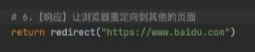
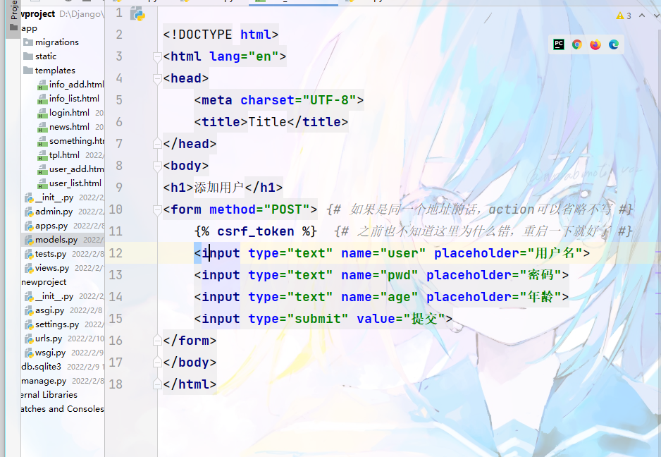
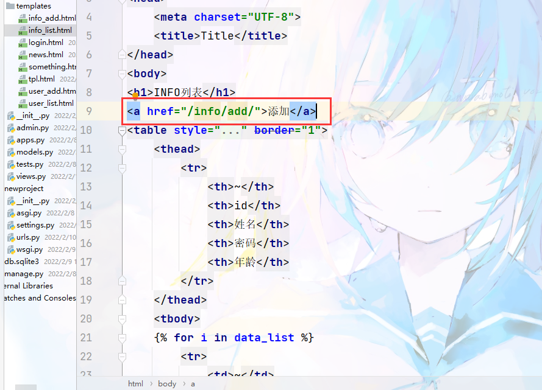

* # P9 html模板

  * 

    上面那块有问题，页面显示不出来
* # P10 请求和响应

  * 1. 


    2. GET（明面上）/POST（表面看不到）


    3. 


    4. 


    5. 


    6.

    也可以不传变量，直接传值

    


    7. 直接跳转到别的网页

    传输方式：用户 --> Django --> 返回网址 --> 浏览器 --> 用户
* # P11登陆注册

  * 1. ## 新建路由和函数（过程省略）
    2. ## 写页面
    3. ```html
        <h1>用户登录</h1>
        <form>
            
            {!--    类型           名称            输入提示    --}
            <input type="text" name="user" placeholder="用户名">
            <input type="password" name="pwd" placeholder="密码">
            <input formmethod="post" type="submit" value="提交">
        </form>
        ```
    4. submit 中加传输方式是为了强调是POST类型的传输方式，不然函数里的else就不生效

        ```py
        # 函数
        def login(request):
            if request.method == "GET":
                return render(request, "login.html")
            else:
                print(request.POST)
                return HttpResponse("登陆成功")
        ```

    5. 关于input传输（POST）

        需要加上（加在表单里）

        ```html
        
        ```

        可以理解为传输加密

        （隐藏）

        用作校验值
    6. 关于校验账号密码是否正确

        ```py
        def login(request):
            if request.method == "GET":
                return render(request, "login.html")
            else:
                print(request.POST)
                username = request.POST.get("user")
                password = request.POST.get("pwd")

                if username == "saber" and password == "Q290538T47":
                    return HttpResponse("登陆成功")
                else:
                    return HttpResponse("登陆失败，密码错误")

        ```


        用来获取输入的数据，user和pwd为提交数据时数据的名词（html文件中已经为数据起好名字，相对应即可）

        ```py
        username = request.POST.get("user")
        password = request.POST.get("pwd")
        ```

    7. 也可以输错以后直接返回登录页面

        

        然后为了使页面有提示消息，我要让页面上有提示

        那就传一个值回去

        在html页面上设置一个渲染变量

        然后我仅在登录错误时才给那个渲染变量赋值

        

        

    8. 优化一下函数if else

        ```py
        def login(request):
            if request.method == "GET":
                return render(request, "login.html")

            print(request.POST)
            username = request.POST.get("user")
            password = request.POST.get("pwd")

            if username == "saber" and password == "Q290538T47":
                return HttpResponse("登陆成功")
            # else:
            # return HttpResponse("登陆失败，密码错误")
            return render(request, "login.html", {"dlsb": "密码错误"})
        ```
* # 7.1 数据库操作

  * Mysql + pymysql
  * Django开发数据库更简单，内部提供 ORM 框架

    * `pip3.9 install mysqlclient`
    * 用上面那个作为数据库
* # 7.2 ORM

  * ORM 

    * 创建、修改、删除 数据库中的表。【无法创建数据库
    * 创建表中的数据
  * 数据库操作

    1. 创建数据库

        * 启动mysql服务
    2. django连接数据库

        * 修改setting里的配置

        ```py
        DATABASES = {
            'default': {
                'ENGINE': 'django.db.backends.mysql',
                'NAME': '5tian', # 数据库名
                'USER': 'root', # 用户名
                'PASSWORD': '123456', # 密码
                'HOST': '', # 服务器地址
                'PORT': '', # 端口
            }
        }
        ```

        

        * 注

          
    3. 基于django创建操作表

        * 创建表在models.py 中写

          * 
          * 一个类是一个表
          * 类名是表名
          * 里面的字段就是字段名
          * charfield()意思是这个字段的最大长度
        * 执行命令

          * ```py
            python manage.py makemigrations
            python manage.py migrate
            ```

            执行上面两个

            * 前提：app已注册
          * 
        * 删除

          * 就是把想删的删掉再执行一遍命令
        * 添加字段

          * 如果之间添加后执行命令会报错，因为不知道这个字段该填哪些数据

            * 此时会有两个选项

              * （1） 输入一个值作为这一个字段的所有值
              * （2） 推出，然后去字段那一行里直接添加默认值

                

                加入deafault = 2 表示为默认值都是2

                此时就不会报错了
          * 或者是设置该字段允许为空

            
    4. 操作表中数据

        * 新建数据

          * 找到那个类名（表名）
          * 在views里引入类

            

            `from  app名.models  import  类名`
          * 在views里编写函数

            * 添加一个数据

              

            * 添加一行数据

              
        * 删除数据

          * 前提条件同上面
          * 删除命令

            

            `类名.objects.filter (限制条件).delete()` 删除部分

            `类名.objects.all().delete()` 删除全部
        * 获取数据

          * `类名.objects.all()`
          * 获取到的是一个列表，可以用for循环读
          * 
          * `类名.objects.filter (限制条件)`
          * 

            即使只有一个数据，但仍然被存在一个列表里


            * 但是当我们知道只有一个数据时可以把那第一个对象也是唯一的对象取出来，这样就不再是一个列表了，它就是一个类似于c++单个结构体变量一样的东西

              用first() 取出

              
    5. 更新数据

        * 更新一个字段下所有的数据

          
        * 某一个或某一些，就需要加筛选条件

          
* # 案例：用户管理

  * 展示用户列表

    * 
    * 
    * 
    * 
    * 关于时间怎么写

      
  * 添加用户

    * url

      
    * 函数

      * GET，看到页面，输入内容

        
      * POST，提交 --> 写到数据库

        

        
      * 列表页面-->添加页面

        
  * 删除用户

    * 方法一

      * 发送请求

        输入要删除的id

        
      * 接受并处理，然后返回

        
      * 渲染页面

        

        
    * 方法二

      * 在P18，懒得做了，后续再补
* Django开发

  * 主题：员工管理系统

　　
