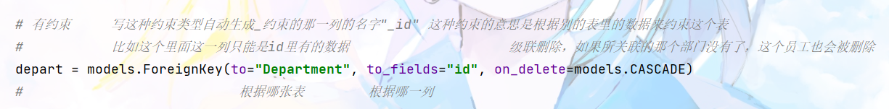
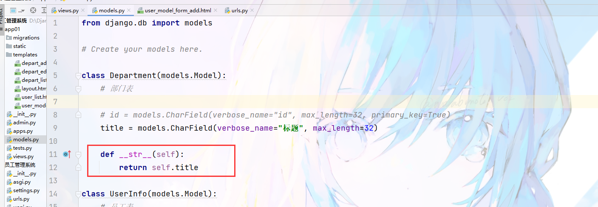

* # 创建 app

  * `python manage.py startapp app01`
  * 或者

    

    但是我用的这个版本好像没有这个工
* # 注册 app

  
* # 表结构

  * 部门表

    * 备注名

      
    * 
    * 
    * 有些字段需要有约束

      

      因为里面的数据不可以乱填没否则无意义

      * 但是向上面那样写是会报错的，因为如果关联的那一列 id 删除了，这一列该怎么办呢，有两种方案

        * 级联删除

          就是关联的那一列删除了，这一行也跟着删除

          
        * 置空

          意思是那一列删除了，这一个格子就置空

          有前提是这个字段要允许为空

          
    * 性别

      * 没有必要新建一个性别表用作关联了
      * 为了节省空间，直接用小整数类型约束
      * 然后新建一个选择变量
      * 然后用 Django 实现只能选则什么字段
      * 
  * 代码

    ```cpp
    from django.db import models

    # Create your models here.

    class Department(models.Model):
        # 部门表
        title = models.CharField(verbose_name="标题", max_length=32)

    class UserInfo(models.Model):
        # 员工表
        name = models.CharField(verbose_name="姓名", max_length=16)
        password = models.CharField(verbose_name="密码", max_length=64)
        age = models.IntegerField(verbose_name="年龄")
        account = models.DecimalField(verbose_name="用户余额", max_digits=10, decimal_places=2, default=0)
        create_time = models.DateTimeField(verbose_name="入职时间")

        # 有约束     写这种约束类型自动生成_约束的那一列的名字"_id" 这种约束的意思是根据别的表里的数据来约束这个表
        #           比如这个里面这一列只能是id里有的数据                    级联删除，如果所关联的那个部门没有了，这个员工也会被删除
        # depart = models.ForeignKey(to="Department", to_fields="id", on_delete=models.CASCADE)
        #                           根据哪张表        根据哪一列

        # 或者 是关联的那一列删除了，那么这一列就为空，和级联删除同理，但是要先设置为空
        depart = models.ForeignKey(to="Department", null=True, blank=True, to_fields="id", on_delete=models.SET_NULL)


        # 在 Django 中的约束
        gender_choices = ( # 新建选择字段
            (1, '男'),
            (2, '女'),
        )
        gender = models.SmallIntegerField(verbose_name="性别", choices=gender_choices)

    ```
  * 执行命令

    * ```py
      python manage.py makemigrations
      python manage.py migrate
      ```

      执行上面两个

      * 前提：app 已注册
  * 成功

    
* # 静态文件

  * 
* # 部门的管理

  > 最原始的方法
  >

  * 部门列表

    
  * url

    * 
  * 函数直接返回视图页面

    * 
  * 页面

    ```html
    
    <!DOCTYPE html>
    <html lang="en">
    <head>
        <meta charset="UTF-8">
        <title>Title</title>
        <link rel="stylesheet" href="">
    {#    去掉圆角#}
        <style>
            .navbar{
                border-radius: 0;
            }
        </style>
    </head>
    <body>

    {# 引入 #}
    <script src=""></script>
    <script src=""></script>

    {#导航条#}
    <nav class="navbar navbar-default">
      <div class="container">{# container-fluid是填满 #}
        <!-- Brand and toggle get grouped for better mobile display -->
        <div class="navbar-header">
          <button type="button" class="navbar-toggle collapsed" data-toggle="collapse" data-target="#bs-example-navbar-collapse-1" aria-expanded="false">
            <span class="sr-only">Toggle navigation</span>
            <span class="icon-bar"></span>
            <span class="icon-bar"></span>
            <span class="icon-bar"></span>
          </button>

    {#        标题#}
          <a class="navbar-brand" href="#">联通用户管理系统</a>
        </div>

        <div class="collapse navbar-collapse" id="bs-example-navbar-collapse-1">
          <ul class="nav navbar-nav">
            <li><a href="/depart/list/">部门管理</a></li>
            <li><a href="#">Link</a></li>

    {#          下拉框#}
    {#        <li class="dropdown">#}
    {#          <a href="#" class="dropdown-toggle" data-toggle="dropdown" role="button" aria-haspopup="true" aria-expanded="false">Dropdown <span class="caret"></span></a>#}
    {#          <ul class="dropdown-menu">#}
    {#            <li><a href="#">Action</a></li>#}
    {#            <li><a href="#">Another action</a></li>#}
    {#            <li><a href="#">Something else here</a></li>#}
    {#            <li role="separator" class="divider"></li>#}
    {#            <li><a href="#">Separated link</a></li>#}
    {#            <li role="separator" class="divider"></li>#}
    {#            <li><a href="#">One more separated link</a></li>#}
    {#          </ul>#}
    {#        </li>#}
          </ul>

    {#        输入框#}
    {#      <form class="navbar-form navbar-left">#}
    {#        <div class="form-group">#}
    {#          <input type="text" class="form-control" placeholder="Search">#}
    {#        </div>#}
    {#        <button type="submit" class="btn btn-default">Submit</button>#}
    {#      </form>#}

    {#        下拉框#}
          <ul class="nav navbar-nav navbar-right">
            <li><a href="#">登录</a></li>
            <li class="dropdown">
              <a href="#" class="dropdown-toggle" data-toggle="dropdown" role="button" aria-haspopup="true" aria-expanded="false">徐晓涵<span class="caret"></span></a>
              <ul class="dropdown-menu">
                <li><a href="#">个人资料</a></li>
                <li><a href="#">我的信息</a></li>
                <li role="separator" class="divider"></li>
                <li><a href="#">注销</a></li>
              </ul>
            </li>
          </ul>
        </div><!-- /.navbar-collapse -->
      </div><!-- /.container-fluid -->
    </nav>

    <div>
        <div class="container">
            <div style="margin: 10px">
                <a class="btn btn-success" href="#">
                    <span class="glyphicon glyphicon-plus-sign" aria-hidden="true"></span> {# 图标 #}
                    新建部门
                </a>
            </div>

           <div class="panel panel-default">


    {#           整个表格#}
          <!-- 这是上面那一列 -->
          <div class="panel-heading">
              <span class="glyphicon glyphicon-th-list" aria-hidden="true"></span> {# 图标 #}
              部门列表
          </div>

          <!-- 表单 -->
          <table class="table table-bordered">
            <thead>
              <tr>
                <th>ID</th>
                <th>名称</th>
                <th>操作</th>
              </tr>
            </thead>
            <tbody>
              <tr>
                <th scope="row">1</th>
                <td>销售部</td>
                <td>
                    <a class="btn btn-primary btn-xs">编辑</a>
                    <a class="btn btn-danger btn-xs">删除</a>
                </td>
              </tr>
            </tbody>
          </table>
        </div>
        </div>
    </div>


    </body>
    </html>
    ```
  * 然部门列表展示数据

    * 在数据库中先手动添加一些数据

      
    * 编写函数，把数去传给前端

      
    * 去前端渲染

      for 循环输出

      
    * 页面

      
    * 
  * 添加部门

    * url

      
    * 函数

      
    * 在列表页面添加

      
    * 页面

      ```html
      
      <!DOCTYPE html>
      <html lang="en">
      <head>
          <meta charset="UTF-8">
          <title>Title</title>
          <link rel="stylesheet" href="">
          <style>
              .navbar{
                  border-radius: 0;
              }
          </style>
      </head>
      <body>
      {# 引入 #}
      <script src=""></script>
      <script src=""></script>

      {#导航条#}
      <nav class="navbar navbar-default">
        <div class="container">{# container-fluid是填满 #}
          <!-- Brand and toggle get grouped for better mobile display -->
          <div class="navbar-header">
            <button type="button" class="navbar-toggle collapsed" data-toggle="collapse" data-target="#bs-example-navbar-collapse-1" aria-expanded="false">
              <span class="sr-only">Toggle navigation</span>
              <span class="icon-bar"></span>
              <span class="icon-bar"></span>
              <span class="icon-bar"></span>
            </button>

      {#        标题#}
            <a class="navbar-brand" href="#">联通用户管理系统</a>
          </div>

          <div class="collapse navbar-collapse" id="bs-example-navbar-collapse-1">
            <ul class="nav navbar-nav">
              <li><a href="/depart/list/">部门管理</a></li>
              <li><a href="#">Link</a></li>

      {#          下拉框#}
      {#        <li class="dropdown">#}
      {#          <a href="#" class="dropdown-toggle" data-toggle="dropdown" role="button" aria-haspopup="true" aria-expanded="false">Dropdown <span class="caret"></span></a>#}
      {#          <ul class="dropdown-menu">#}
      {#            <li><a href="#">Action</a></li>#}
      {#            <li><a href="#">Another action</a></li>#}
      {#            <li><a href="#">Something else here</a></li>#}
      {#            <li role="separator" class="divider"></li>#}
      {#            <li><a href="#">Separated link</a></li>#}
      {#            <li role="separator" class="divider"></li>#}
      {#            <li><a href="#">One more separated link</a></li>#}
      {#          </ul>#}
      {#        </li>#}
            </ul>

      {#        输入框#}
      {#      <form class="navbar-form navbar-left">#}
      {#        <div class="form-group">#}
      {#          <input type="text" class="form-control" placeholder="Search">#}
      {#        </div>#}
      {#        <button type="submit" class="btn btn-default">Submit</button>#}
      {#      </form>#}

      {#        下拉框#}
            <ul class="nav navbar-nav navbar-right">
              <li><a href="#">登录</a></li>
              <li class="dropdown">
                <a href="#" class="dropdown-toggle" data-toggle="dropdown" role="button" aria-haspopup="true" aria-expanded="false">徐晓涵<span class="caret"></span></a>
                <ul class="dropdown-menu">
                  <li><a href="#">个人资料</a></li>
                  <li><a href="#">我的信息</a></li>
                  <li role="separator" class="divider"></li>
                  <li><a href="#">注销</a></li>
                </ul>
              </li>
            </ul>
          </div><!-- /.navbar-collapse -->
        </div><!-- /.container-fluid -->
      </nav>

      <div>
          <div class="container">
              <div class="panel panel-default">
                <div class="panel-heading">
                  <h3 class="panel-title"> 新建部门 </h3>
                </div>
                <div class="panel-body">
                    <form>
                         <div class="form-group">
                             <label>标题</label>
                             <input type="text" class="form-control" placeholder="标题" name="title">
                         </div>

                      <button type="submit" class="btn btn-primary">提 交</button>

                    </form>

                </div>
              </div>
          </div>
      </div>


      </body>
      </html>
      ```

    * 功能实现

      * 函数

        
      * 提交数据

        
  * 删除部门

    * url

      
    * 函数

      通过 url 传参的形式来读取 id

      删除完之后还返回

      
    * 页面

      这样用{{  }}包住的就是数据，这样就可以传给 delete 函数

      
  * 编辑部门

    * url

      这是一种新的可以通过 url 获取数据的方式

      
    * 函数

      
    * 视图

      这一整个是复制的 add 的

      修改部分已经圈出

      

      
    * 函数

      
    * 视图

      
* # 模板的继承

  * 部门列表
  * 添加部门
  * 编辑部门
  * 所有的状态条都是复制粘贴的，一旦要修改就很麻烦
  * Django 中支持模板的继承
  * 模板文件

    * ```html
      
      <!DOCTYPE html>
      <html lang="en">
      <head>
          <meta charset="UTF-8">
          <title>Title</title>
          <link rel="stylesheet" href="">
          <style>
              .navbar{
                  border-radius: 0;
              }
          </style>
      </head>
      <body>

      {#导航条#}
      <nav class="navbar navbar-default">
        <div class="container">{# container-fluid是填满 #}
          <!-- Brand and toggle get grouped for better mobile display -->
          <div class="navbar-header">
            <button type="button" class="navbar-toggle collapsed" data-toggle="collapse" data-target="#bs-example-navbar-collapse-1" aria-expanded="false">
              <span class="sr-only">Toggle navigation</span>
              <span class="icon-bar"></span>
              <span class="icon-bar"></span>
              <span class="icon-bar"></span>
            </button>

      {#        标题#}
            <a class="navbar-brand" href="#">联通用户管理系统</a>
          </div>

          <div class="collapse navbar-collapse" id="bs-example-navbar-collapse-1">
            <ul class="nav navbar-nav">
              <li><a href="/depart/list/">部门管理</a></li>
              <li><a href="#">Link</a></li>

      {#          下拉框#}
      {#        <li class="dropdown">#}
      {#          <a href="#" class="dropdown-toggle" data-toggle="dropdown" role="button" aria-haspopup="true" aria-expanded="false">Dropdown <span class="caret"></span></a>#}
      {#          <ul class="dropdown-menu">#}
      {#            <li><a href="#">Action</a></li>#}
      {#            <li><a href="#">Another action</a></li>#}
      {#            <li><a href="#">Something else here</a></li>#}
      {#            <li role="separator" class="divider"></li>#}
      {#            <li><a href="#">Separated link</a></li>#}
      {#            <li role="separator" class="divider"></li>#}
      {#            <li><a href="#">One more separated link</a></li>#}
      {#          </ul>#}
      {#        </li>#}
            </ul>

      {#        输入框#}
      {#      <form class="navbar-form navbar-left">#}
      {#        <div class="form-group">#}
      {#          <input type="text" class="form-control" placeholder="Search">#}
      {#        </div>#}
      {#        <button type="submit" class="btn btn-default">Submit</button>#}
      {#      </form>#}

      {#        下拉框#}
            <ul class="nav navbar-nav navbar-right">
              <li><a href="#">登录</a></li>
              <li class="dropdown">
                <a href="#" class="dropdown-toggle" data-toggle="dropdown" role="button" aria-haspopup="true" aria-expanded="false">徐晓涵<span class="caret"></span></a>
                <ul class="dropdown-menu">
                  <li><a href="#">个人资料</a></li>
                  <li><a href="#">我的信息</a></li>
                  <li role="separator" class="divider"></li>
                  <li><a href="#">注销</a></li>
                </ul>
              </li>
            </ul>
          </div><!-- /.navbar-collapse -->
        </div><!-- /.container-fluid -->
      </nav>

      <div>
          {# 特殊的占位符，如果要使用这个模板的话，就相当于所有的内容直接在这个模板中block的部分编写了#}
          {# 别的文件调用时写 #}
      {#      那个文件的内容  #}
          
      </div>

      {# 引入 #}
      <script src=""></script>
      <script src=""></script>
      </body>
      </html>
      ```
  * 详细用法

    * 
    * 示例

      
  * 而且可以定义多个

    * 意思就是整个模板页面过来了，然后在指定位置填充
  * 图示

    
  * 代码

    ```py
    

    
    ```
* # 用户管理

  * ## 用户列表

    * 将时间转为字符串输出

      
    * 如何获取数字对于那个元组里套元组，用数字对应字符串的那个，Django 自动封装了一个功能，可以直接输出那个所对应的字符串（python 中）

      
    * 如何直接输出当前数据关联的另一个表的数据

      * 上面这个表里_id 说明的是数据关联的是另一张表里的 id，所以数据库自动生成的，下面那个不带 id，说明直接用 django 里的功能后面.title 就是直接获取那个所关联的那一行里的那一个数据（python 中）

        * 
    * 把上述转换到 html 中会出现语法问题，需要进行修改

      * 
      * 1. 模板里面不能加函数括号，所以把括号删掉，因为有需要加括号的地方，他会自动帮你加
        2. 关于把时间改成字符串的写法在 html 中把括号后面所对应的内容改成 `|date: "Y-m-d H:i:s"`,代表的就是时间格式
    * 代码

      * ```html
        

        
            <div>
            <div class="container">
                <div style="margin: 10px">
                    <a class="btn btn-success" href="#" >
                        <span class="glyphicon glyphicon-plus-sign" aria-hidden="true"></span> {# 图标 #}
                        新建用户
                    </a>
                </div>

               <div class="panel panel-default">


        {#           整个表格#}
              <!-- 这是上面那一列 -->
              <div class="panel-heading">
                  <span class="glyphicon glyphicon-th-list" aria-hidden="true"></span> {# 图标 #}
                  用户列表
              </div>

              <!-- 表单 -->
              <table class="table table-bordered">
                <thead>
                  <tr>
                    <th>ID</th>
                    <th>姓名</th>
                    <th>密码</th>
                    <th>年龄</th>
                    <th>余额</th>
                    <th>入职时间</th>
                    <th>性别</th>
                    <th>所属部门</th>
                    <th>操作</th>
                  </tr>
                </thead>
                <tbody>
                  
                      <tr>
                        <th scope="row">{{ i.id }}</th>
                        <td>{{ i.name }}</td>
                        <td>{{ i.password }}</td>
                        <td>{{ i.age }}</td>
                        <td>{{ i.account }}</td>
                        <td>{{ i.create_time|date:"Y-m-d" }}</td>
                        <td>{{ i.get_gender_display }}</td>
                        <td>{{ i.depart.title }}</td> {# 这样是输出关联值 #}
                        <td>{{ i.depart_id.title }}</td> {# 这样是输出值,类似哈希 #}
                        <td>
                            <a class="btn btn-primary btn-xs" href="/depart/{{ i.id }}/edit/">编辑</a>
                            <a class="btn btn-danger btn-xs" href="/depart/delete/?nid={{ i.id }}">删除</a>
                        </td>
                      </tr>
                  


                </tbody>
              </table>
            </div>
            </div>
        </div>
        

        ```

        * 重点

          
  * ## 添加用户朴素做法

    * 

      添加用户时，之间建立选项，然后选项的有男和女，对应的值分别是 1 和 2，也就是说选择男或女，实际上提交的数据是 1 或 2
    * 但是那样手动写还是太烦了
    * 于是
    * 就在后端函数里，把在数据库里的数据和那个选择元组传进前端页面
    * 
    * 然后在前端页面写选项时直接写 for 循环即可
    * 元组里每一个对象就像数组一样，第一个下标是 0，第二个下标是 1……
    * 然后数据库里的对象调用方法就是 for 循环调用数据库数据，然后调出 title 即可
    * 注：上面的选项都需要卸载选项列表里
    * 
  * ## 新建用户 ModelForm

    * url

      * 
    * views 函数

      * 
      * ① 首先要引入 forms
      * ② 然后要写一个类，里面都是固定格式
      * ③ 接着写函数，把那个类作为参数传到前端页面上去
    * 前端

      * 
      * 写一个表单
      * 然后在里面用后端渲染的方式写，`.label` 意思就是取表格中的数据的名称
    * 优化

      * 但是像上面那样写还是太麻烦了，因为要一个一个的手动写
      * 可以用循环来写
      * 
      * 这样就方便多了，我们把所有的字段都加进去
      * 
  * 在页面中，那个部门可能会变成奇怪的东西

    * 
    * 原因

      * 
      * 因为它循环展示的是一个对象，就像是二维数组里的一行数据
      * 但是我们需要的是二维数组一行里的某一个数据，我们就需要定制输出
      * 
      * 在类里面定义一个 `__str__` 这样就可以实现定制输出了
      * 
      * 在自己的代码中这么写

        * 
  * 接着给页面加上格式

    * 
    * 

      输入框样式可以在类里面添加插件来完成
    * 但是向上面那样一个一个写太烦了

      
    * 这个是根据源码改编的，只要记得固定格式就好，大概可以理解为把 fields 里的每个东西取出来，给它加插件
    * ```py
       def __init__(self, *args, **kwargs):
              super().__init__(*args, **kwargs)
              for name, field in self.fields.items():
                  # print(name, field)

                  field.widget.attrs = {"class": "form-control", "placeholder": field.label}

      ```
    * 数据保存

      * views 函数

        * 
    * 数据校验

      * 函数

        * 
      * 视图

        * 错误列表名叫 errors
        * 
      * 如果想对某个数据有单独的限制的话，在函数的 modelform 类中，那个字段就需要单独写，写法同 models

        
  * ## 编辑用户

    * 
    * 编辑页面

      * 
      * 只要在括号中加上 `instance` 后面加上一个对象，就可以实现输入框内自动有数据
    * 提交

      * 错误提示
      * 错误校验
      * 在数据库更新

        * 
    * 优化一下时间框

      * 修改数据库表结构
      * 
      * 改完以后执行两个命令更新数据库
      * ```py
        python manage.py makemigrations
        python manage.py migrate
        ```
      * 
  * ## 删除用户

    * url

      * 
    * views

      * 
    * 视图

      * 
* # 语言

  * ```py
    LANGUAGE_CODE = 'en-us' # 英文
    LANGUAGE_CODE = 'zh-hans' # 中文
    ```

    在 settings 里修改
