* # 靓号管理

  * ## 表结构

    * `id，mobile，level(choices)(类似性别)，status（1未占用，2已占用）`

      ```Python
      class PrettyNum(models.Model):
          # 靓号表
      mobile = models.CharField(verbose_name = "手机号", max_length=11)
          price = models.IntegerField(verbose_name = "价格", default=0)

          level_choices = (
              (1, "1级"),
              (2, "2级"),
              (3, "3级"),
              (4, "4级"),
          )
          level = models.SmallIntegerField(verbose_name="级别", choices=level_choices, default=1)

          stauts_choices = (
              (1, "已占用"),
              (2, "未占用"),
          )
          stauts = models.SmallIntegerField(verbose_name="状态", choices=stauts_choices, default=2)
      ```

* # 靓号列表

  * ## URL

    ```Python
    path('pretty/list/', views.pretty_list),
    ```
  * ## 函数

    * 获取所有靓号
    * 结合html和render将靓号罗列出来

      ```Python
      def pretty_list(request):
          # 靓号列表
          #                                          降序排序
      queryset = models.PrettyNum.objects.all().order_by("-level")
          return render(request, "pretty_list.html",{"queryset": queryset})
      ```
  * ## 视图

    ```HTML
    

    
        <div class="container">
            <div style="margin: 10px">
                <a class="btn btn-success" href="#" >
                    <span class="glyphicon glyphicon-plus-sign" aria-hidden="true"></span> {# 图标 #}
    新建靓号
                </a>

            </div>

           <div class="panel panel-default">


    {#           整个表格#}
          <!-- 这是上面那一列 -->
    <div class="panel-heading">
              <span class="glyphicon glyphicon-th-list" aria-hidden="true"></span> {# 图标 #}
    用户列表
          </div>

          <!-- 表单 -->
    <table class="table table-bordered">
            <thead>
              <tr>
                <th>ID</th>
                <th>号码</th>
                <th>价格</th>
                <th>级别</th>
                <th>状态</th>
                <th>操作</th>
              </tr>
            </thead>
            <tbody>
              
                  <tr>
                    <th scope="row">{{ i.id }}</th>
                    <td>{{ i.mobile }}</td>
                    <td>{{ i.price }}</td>
                    <td>{{ i.get_level_display }}</td>
                    <td>{{ i.get_stauts_display }}</td>
    {#                <td>{{ i.depart_id.title }}</td> {# 这样是输出值,类似哈希 #}
    <td>
                        <a class="btn btn-primary btn-xs" href="/user/{{ i.id }}/edit/">编辑</a>
                        <a class="btn btn-danger btn-xs" href="/user/{{ i.id }}/delate/">删除</a>
                    </td>
                  </tr>
              


            </tbody>
          </table>
        </div>
        </div>

    
    ```

* # 新建靓号

  * ## 列表

    点击跳转`/pretty/add/`
  * ## URL
  * ## ModelForm类

    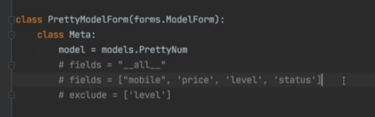

    全部字段

    自定义

    排除
  * ## 函数

    * 实例化的对象

      ```Python
      class PrettyModelForm(forms.ModelForm):
          class Meta:
              model = models.PrettyNum
              fields = ["mobile", "price", "level", "stauts"]

      def pretty_add(request):
      #         添加靓号
      form = PrettyModelForm()
          return render(request, 'pretty_add.html', {"form": form})
      ```
    * 通过render将对象传入HTML中
    * 模板循环展示所有字段

      ```Python
      页面
      

      

      <div>
          <div class="container">
              <div class="panel panel-default">
                <div class="panel-heading">
                  <h3 class="panel-title"> 新建靓号 </h3>
                </div>
                <div class="panel-body">
      {#              不写action就是提交到当前地址#}
      {#                                 关闭浏览器校验#}
      <form method="post" novalidate>
                        
                          
                              <div class="form-group">
                                  <label>{{ i.label }}</label> {# label加粗 #}
      {{ i }}
                                  <span style="color: #c7254e">{{ i.errors.0 }}</span> {# 如果有错误信息就会输出,获取的是一个列表，我只要输出第一个错误 #}
      </div>
                          


                      <button type="submit" class="btn btn-primary">提 交</button>

                    </form>

                </div>
              </div>
          </div>
      </div>

      

      {#<form method="post">#}
      {#        #}
      {##}
      {#        #}
      {#            {{ i.label }}: {{ i }}#}
      {#        #}
      {##}
      {# 这样可以使输入框前面显示那个表中的备注名#}
      {#        {{ form.name.label }}: {{ form.name }}#}
      {#        {{ form.password.label }}: {{ form.password }}#}
      {#        {{ form.age.label }}:{{ form.age }}#}
      {#    </form>#}
      ```
  * ## 点击提交

    * ### 数据校验

      * 这里用到了 **正则表达式** ，详细见代码

        ```Python
        # 正则表达式的引入
        from django.core.validators import RegexValidator

        class PrettyModelForm(forms.ModelForm):
            mobile = forms.CharField(
                label="手机号",
                #  正则表达式固定格式 条件（这是标准手机号的正则表达式）  不符合输出的
        validators=[RegexValidator(r'^1[3-9]\d{9}$', "手机号格式错误")],
            )
            class Meta:
                model = models.PrettyNum
                fields = ["mobile", "price", "level", "stauts"]
            def __init__(self, *args, **kwargs):
                super().__init__(*args, **kwargs)
                for name, field in self.fields.items():
                    field.widget.attrs = {"class": "form-control", "placeholder": field.label}
          

        def pretty_add(request):
        #         添加靓号
        if request.method == "GET":
                form = PrettyModelForm()
                return render(request, 'pretty_add.html', {"form": form})
            form = PrettyModelForm(data=request.POST)

            if form.is_valid():
                form.save()
                return redirect('/pretty/list/')
            return render(request, 'pretty_add.html', {"form": form})  
        ```
      * 还有验证数据的**第二种方法**

        ```Python
        # 正则表达式的引入
        from django.core.validators import RegexValidator
        from django.core.exceptions import ValidationError


        class PrettyModelForm(forms.ModelForm):
            # 验证方法一：
            # mobile = forms.CharField(
            #     label="手机号",
            #     #  正则表达式固定格式 条件（这是标准手机号的正则表达式）  不符合输出的
            #     validators=[RegexValidator(r'^1[3-9]\d{9}$', "手机号格式错误")],
            # )
        class Meta:
                model = models.PrettyNum
                fields = ["mobile", "price", "level", "stauts"]
            def __init__(self, *args, **kwargs):
                super().__init__(*args, **kwargs)
                for name, field in self.fields.items():
                    field.widget.attrs = {"class": "form-control", "placeholder": field.label}
        #     验证方法2：
        def clean_mobile(self):
        # 获取用户提交的数据
        txt_mobile = self.cleaned_data["mobile"]
                if len(txt_mobile) != 11:
        #             验证不通过
        raise ValidationError("格式错误")
        #         验证通过，把用户输入的值返回
        return txt_mobile
        ```
    * 保存到数据库
    * 跳转回靓号列表

* # 编辑靓号

  * ## 列表页面：`/pretty/数字/edit/`
  * ## URL

    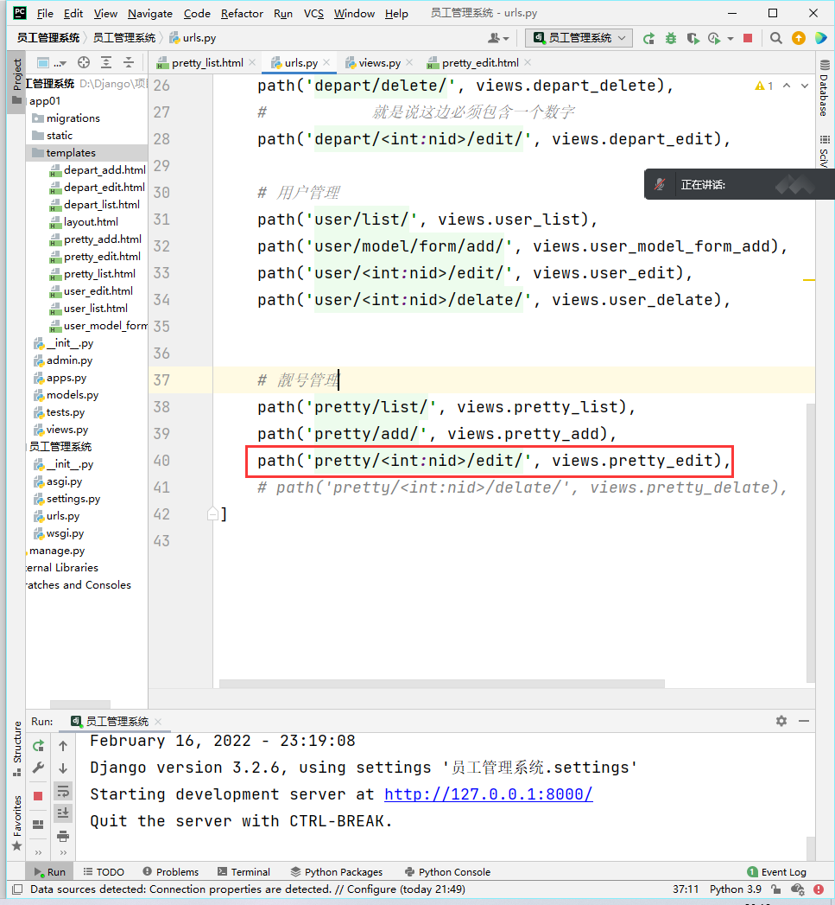
  * ## 函数

    * 根据id获取当前编辑的对象

      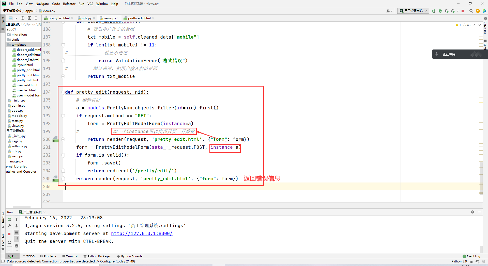
    * ModelForm配合，默认显示数据

      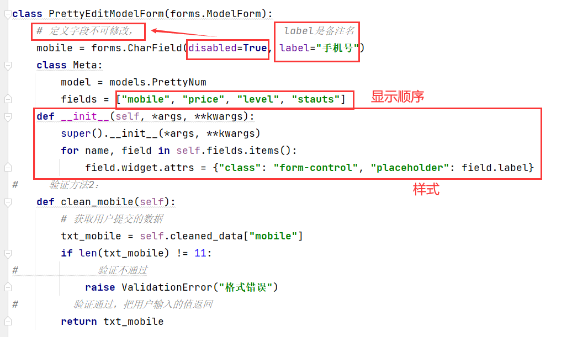
    * 提交修改

      ```html
      

      

          <div class="container">
              编辑用户
          </div>
          <div>
              <div class="container">
                  <div class="panel panel-default">
                        <div class="panel-heading">
                          <h3 class="panel-title"> 编辑靓号 </h3>
                        </div>
                        <div class="panel-body">
              {#              不写action就是提交到当前地址#}
              {#                                 关闭浏览器校验#}
                            <form method="post" novalidate>
                                
                                  
                                      <div class="form-group">
                                          <label>{{ i.label }}</label> {# label加粗 #}
                                          {{ i }}
                                          <span style="color: #c7254e">{{ i.errors.0 }}</span> {# 如果有错误信息就会输出,获取的是一个列表，我只要输出第一个错误 #}
                                      </div>
                                  


                          <button type="submit" class="btn btn-primary">提 交</button>

                            </form>

                    </div>
                  </div>
              </div>
          </div>
      
      ```
  * ## 使手机号码不重复

    * ### 添加手机号

      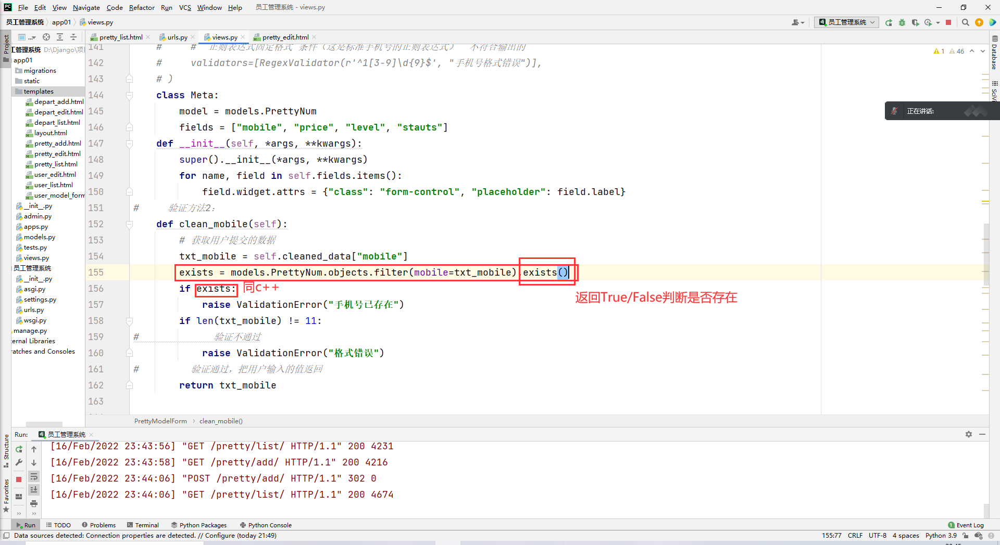
    * ### 编辑手机号

      * 因为编辑时，如果手机号码不变，它会出错，它本身会被判断为重复的。
      * 所以我们需要增加一个条件就是搜索手机号时，同时排除id = 它自己的

      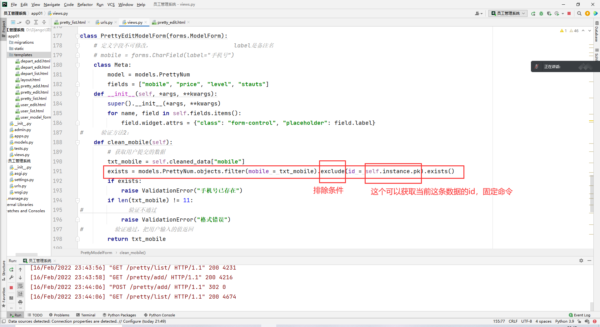

* # 删除号码

  * ## URL

    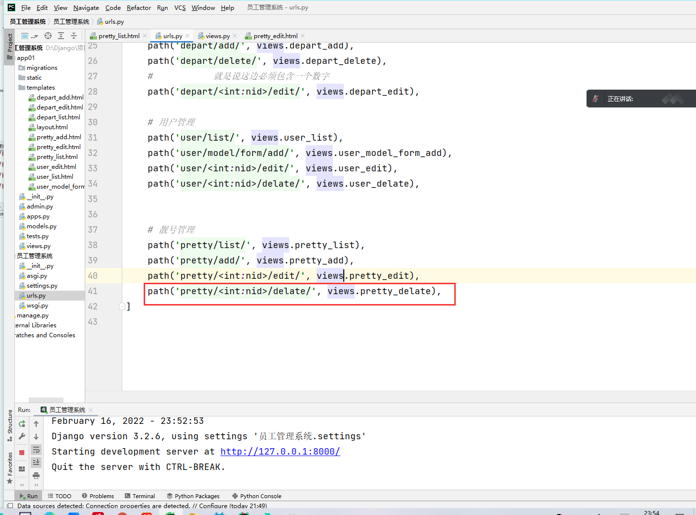
  * ## 函数.

    ```python
    def pretty_delate(request, nid):
        models.PrettyNum.objects.filter(id=nid).delete()
        return redirect('/pretty/list/')
    ```

* # 搜索手机号

  * ## 筛选方法

    ```python
    models.PrettyNum.objects.filter(mobile="19999999991",id=12) # 筛选

    # 筛选方法2
    data_dict = {"mobile":"19999999991","id":123}
    models.PrettyNum.objects.filter(**data_dict)
    ```

    ```python
    models.PrettyNum.objects.filter(id=12)       # 等于12
    models.PrettyNum.objects.filter(id__gt=12)   # 大于12
    models.PrettyNum.objects.filter(id__gte=12)  # 大于等于12
    models.PrettyNum.objects.filter(id__lt=12)   # 小于12
    models.PrettyNum.objects.filter(id__lte=12)  # 小于等于12

    data_dict = {"id__lte":12}
    models.PrettyNum.objects.filter(**data_dict)
    ```

    ```python
    models.PrettyNum.objects.filter(mobile="999")               # 等于
    models.PrettyNum.objects.filter(mobile__startswith="1999")  # 筛选出以1999开头
    models.PrettyNum.objects.filter(mobile__endswith="999")     # 筛选出以999结尾
    models.PrettyNum.objects.filter(mobile__contains="999")     # 筛选出包含999

    # 或者
    data_dict = {"mobile__contains":"999"}
    models.PrettyNum.objects.filter(**data_dict)

    ```

  * 直接用form表单GET方式向自己传值，就可以实现，？{{name}} = 值，接在后面，通过URL

  * 得到值以后

    * 最后是根据前端传来的数据，再把那个数据返回到前端，使搜索框里有一个之前输入的默认值

      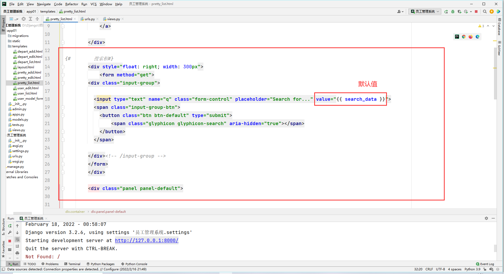

      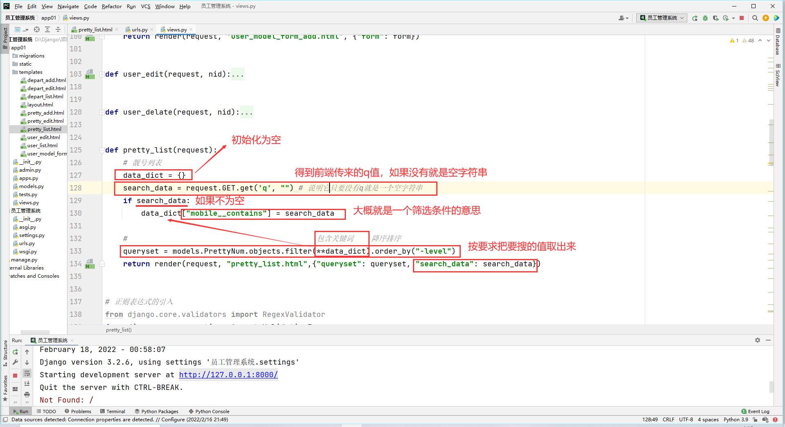

* # 分页

  * ## 分页写法原理

    ```python
    queryset = models.PrettyNum.objects.all()

    queryset = models.PrettyNum.objects.filter(id=1)[0:10] #前十条


    # 第1页
    queryset = models.PrettyNum.objects.all()[0:10]

    # 第2页
    queryset = models.PrettyNum.objects.all()[10:20]

    # 第3页
    queryset = models.PrettyNum.objects.all()[20:30]
    ```

    ```python
    data = models.PrettyNum.objects.all().count() # 获取数量
    data = models.PrettyNum.objects.filter(id=1).count()
    ```

  * ## 分页的逻辑和处理规则

    * ### 封装分页类

      * 从头到尾开发
      * 写项目用【pagination.py】公共组件。
    * ### 小Bug，搜索 + 分页情况下。

      ```django
      分页时候，保留原来的搜索条件

      http://127.0.0.1:8000/pretty/list/?q=888
      http://127.0.0.1:8000/pretty/list/?page=1

      http://127.0.0.1:8000/pretty/list/?q=888&page=23
      ```
    * ### join()

      直接把数组作为字符串加到后面

      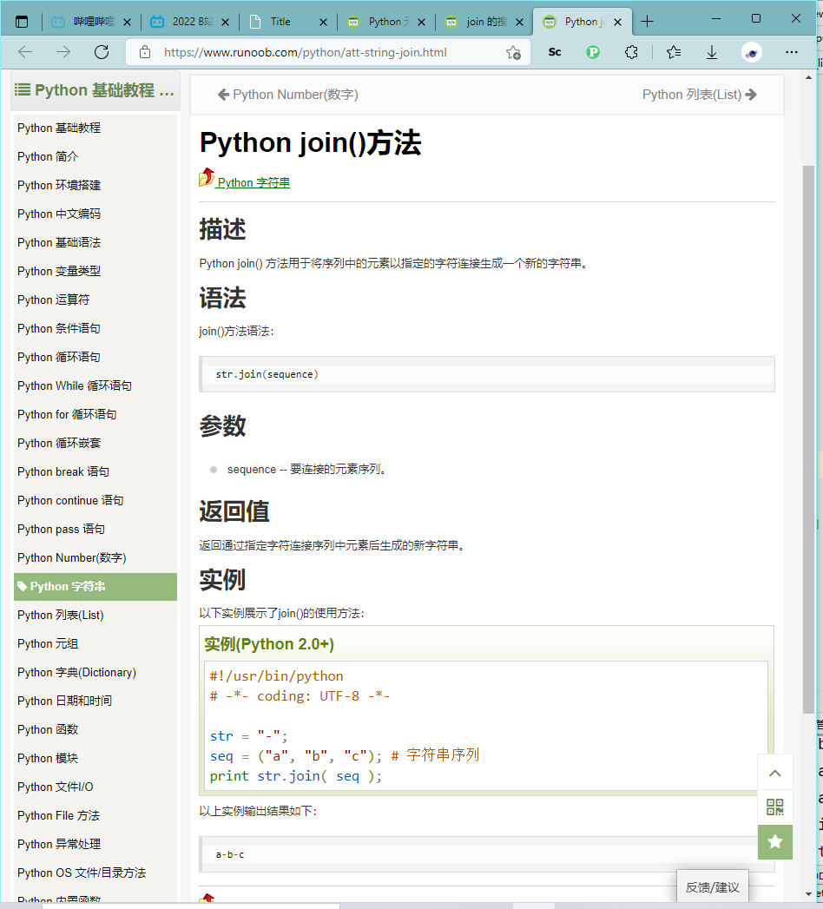
  * ## 方法1：

    在函数里生成代码，然后传到HTML里面用

    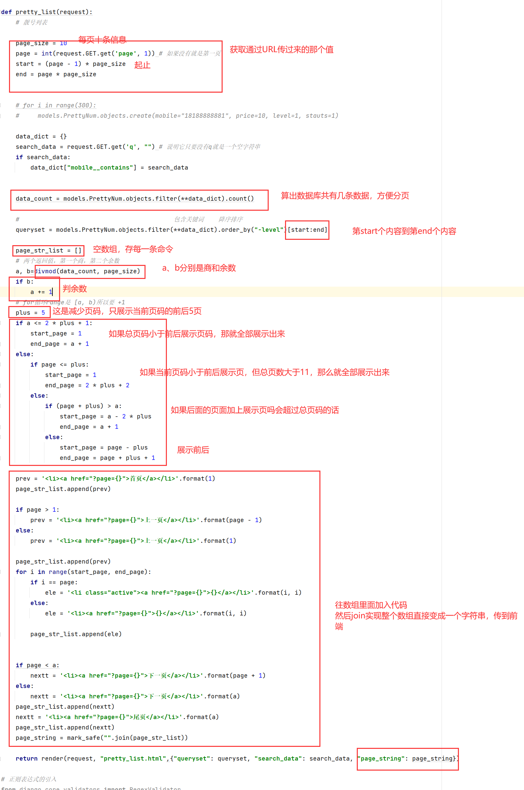

    * 要想使字符串传到前端作为代码生效，需要确定这个字符串是安全的

      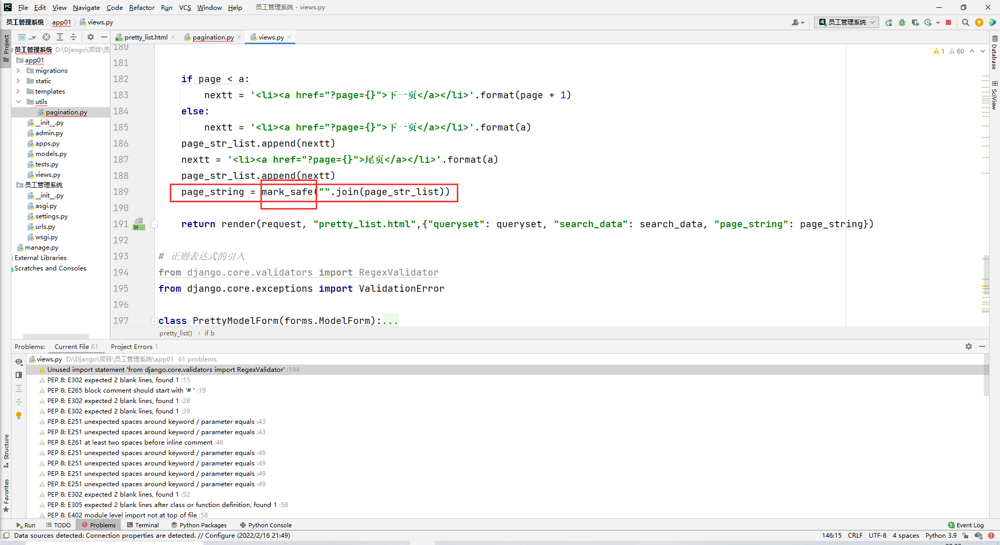
  * ## 方法2：

    * ### 使用组件方法

      1. 代码

          ```python
          """
          自定义的分页组件，以后如果想要使用这个分页组件，你需要做如下几件事：

          在视图函数中：
              def pretty_list(request):

                  # 1.根据自己的情况去筛选自己的数据
                  queryset = models.PrettyNum.objects.all()

                  # 2.实例化分页对象
                  page_object = Pagination(request, queryset)

                  context = {
                      "queryset": page_object.page_queryset,  # 分完页的数据
                      "page_string": page_object.html()       # 生成页码
                  }
                  return render(request, 'pretty_list.html', context)

          在HTML页面中

              
                  {{obj.xx}}
              

              <ul class="pagination">
                  {{ page_string }}
              </ul>

          """

          from django.utils.safestring import mark_safe


          class Pagination(object):

              def __init__(self, request, queryset, page_size=10, page_param="page", plus=5):
                  """
                  :param request: 请求的对象
                  :param queryset: 符合条件的数据（根据这个数据给他进行分页处理）
                  :param page_size: 每页显示多少条数据
                  :param page_param: 在URL中传递的获取分页的参数，例如：/etty/list/?page=12
                  :param plus: 显示当前页的 前或后几页（页码）
                  """

                  from django.http.request import QueryDict
                  import copy
                  query_dict = copy.deepcopy(request.GET)
                  query_dict._mutable = True
                  self.query_dict = query_dict

                  self.page_param = page_param
                  page = request.GET.get(page_param, "1")

                  if page.isdecimal():
                      page = int(page)
                  else:
                      page = 1

                  self.page = page
                  self.page_size = page_size

                  self.start = (page - 1) * page_size
                  self.end = page * page_size

                  self.page_queryset = queryset[self.start:self.end]

                  total_count = queryset.count()
                  total_page_count, div = divmod(total_count, page_size)
                  if div:
                      total_page_count += 1
                  self.total_page_count = total_page_count
                  self.plus = plus

              def html(self):
                  # 计算出，显示当前页的前5页、后5页
                  if self.total_page_count <= 2 * self.plus + 1:
                      # 数据库中的数据比较少，都没有达到11页。
                      start_page = 1
                      end_page = self.total_page_count
                  else:
                      # 数据库中的数据比较多 > 11页。

                      # 当前页<5时（小极值）
                      if self.page <= self.plus:
                          start_page = 1
                          end_page = 2 * self.plus + 1
                      else:
                          # 当前页 > 5
                          # 当前页+5 > 总页面
                          if (self.page + self.plus) > self.total_page_count:
                              start_page = self.total_page_count - 2 * self.plus
                              end_page = self.total_page_count
                          else:
                              start_page = self.page - self.plus
                              end_page = self.page + self.plus

                  # 页码
                  page_str_list = []

                  self.query_dict.setlist(self.page_param, [1])
                  page_str_list.append('<li><a href="?{}">首页</a></li>'.format(self.query_dict.urlencode()))

                  # 上一页
                  if self.page > 1:
                      self.query_dict.setlist(self.page_param, [self.page - 1])
                      prev = '<li><a href="?{}">上一页</a></li>'.format(self.query_dict.urlencode())
                  else:
                      self.query_dict.setlist(self.page_param, [1])
                      prev = '<li><a href="?{}">上一页</a></li>'.format(self.query_dict.urlencode())
                  page_str_list.append(prev)

                  # 页面
                  for i in range(start_page, end_page + 1):
                      self.query_dict.setlist(self.page_param, [i])
                      if i == self.page:
                          ele = '<li class="active"><a href="?{}">{}</a></li>'.format(self.query_dict.urlencode(), i)
                      else:
                          ele = '<li><a href="?{}">{}</a></li>'.format(self.query_dict.urlencode(), i)
                      page_str_list.append(ele)

                  # 下一页
                  if self.page < self.total_page_count:
                      self.query_dict.setlist(self.page_param, [self.page + 1])
                      prev = '<li><a href="?{}">下一页</a></li>'.format(self.query_dict.urlencode())
                  else:
                      self.query_dict.setlist(self.page_param, [self.total_page_count])
                      prev = '<li><a href="?{}">下一页</a></li>'.format(self.query_dict.urlencode())
                  page_str_list.append(prev)

                  # 尾页
                  self.query_dict.setlist(self.page_param, [self.total_page_count])
                  page_str_list.append('<li><a href="?{}">尾页</a></li>'.format(self.query_dict.urlencode()))

                  search_string = """
                      <li>
                          <form style="float: left;margin-left: -1px" method="get">
                              <input name="page"
                                     style="position: relative;float:left;display: inline-block;width: 80px;border-radius: 0;"
                                     type="text" class="form-control" placeholder="页码">
                              <button style="border-radius: 0" class="btn btn-default" type="submit">跳转</button>
                          </form>
                      </li>
                      """

                  page_str_list.append(search_string)
                  page_string = mark_safe("".join(page_str_list))
                  return page_string
          ```
      2. 在函数中

          在函数中这么写，就不用额外再写一个`queryset`渲染值了

          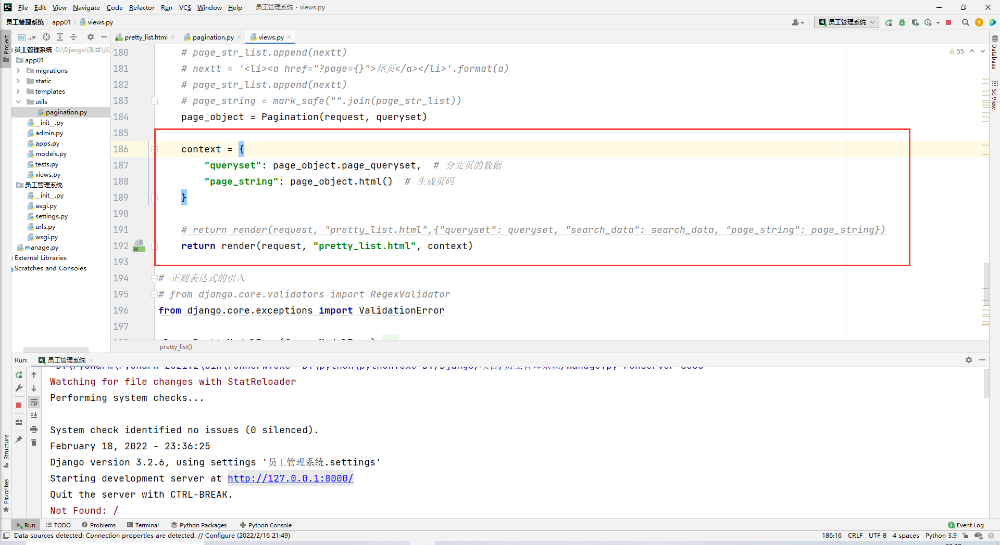
      3. 在页面中

          ```html
              
                  {{obj.xx}}
              

              <ul class="pagination">
                  {{ page_string }}
              </ul>
          ```

* # 时间插件

  ```
  <link rel="stylesheet" href="static/plugins/bootstrap-3.4.1/css/bootstrap.css">
  <link rel="stylesheet" href="static/plugins/bootstrap-datepicker/css/bootstrap-datepicker.css">


  <input type="text" id="dt" class="form-control" placeholder="入职日期">


  <script src="static/js/jquery-3.6.0.min.js"></script>
  <script src="static/plugins/bootstrap-3.4.1/js/bootstrap.js"></script>
  <script src="static/plugins/bootstrap-datepicker/js/bootstrap-datepicker.js"></script>
  <script src="static/plugins/bootstrap-datepicker/locales/bootstrap-datepicker.zh-CN.min.js"></script>


  <script>
      $(function () {
          $('#dt').datepicker({
              format: 'yyyy-mm-dd',
              startDate: '0',
              language: "zh-CN",
              autoclose: true
          });

      })
  </script>
  ```

  * 时间插件需要额外引入一个包

    * [how-to-add-datepicker-in-bootstrap.zip](assets/how-to-add-datepicker-in-bootstrap-20220219005314-189so18.zip)
  * 然后对应的引入如上面代码块里需要的
  * 上面的放在head里是css
  * 下面的放在末尾，是js
  * 还有那个<script>里面的，#dt实际上就是名字， 然后对应的再input框中加上一个id="dt"，那个框就可以选时间了，然后一半默认的数据库字段id为`id_字段名`，方便起见，直接把引入的 \#后面的名字写成默认id名字
  * ## BUG

    * 如果出现了jQery引入失败
    * ```html
      <script src="https://ajax.aspnetcdn.com/ajax/jQuery/jquery-3.2.1.min.js"></script>
      ```

      * 就在引入中加入如上代码

* # ModelForm和BootStrap

  * ## 提取公共的类

    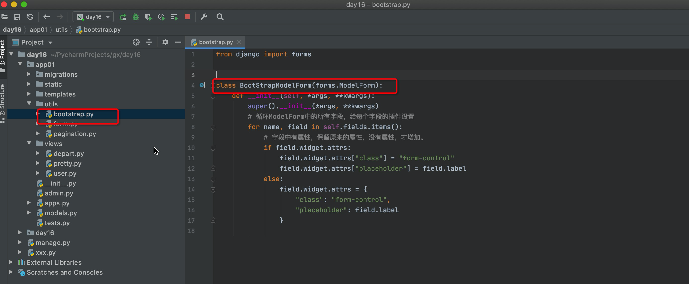  
    ​
  * ## ModelForm拆分出来

    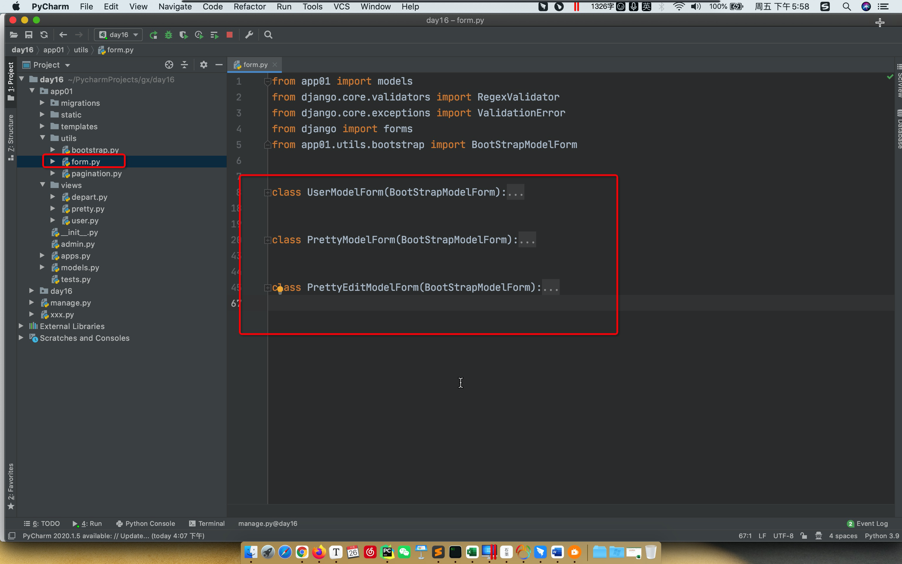
  * ## 视图函数的归类

    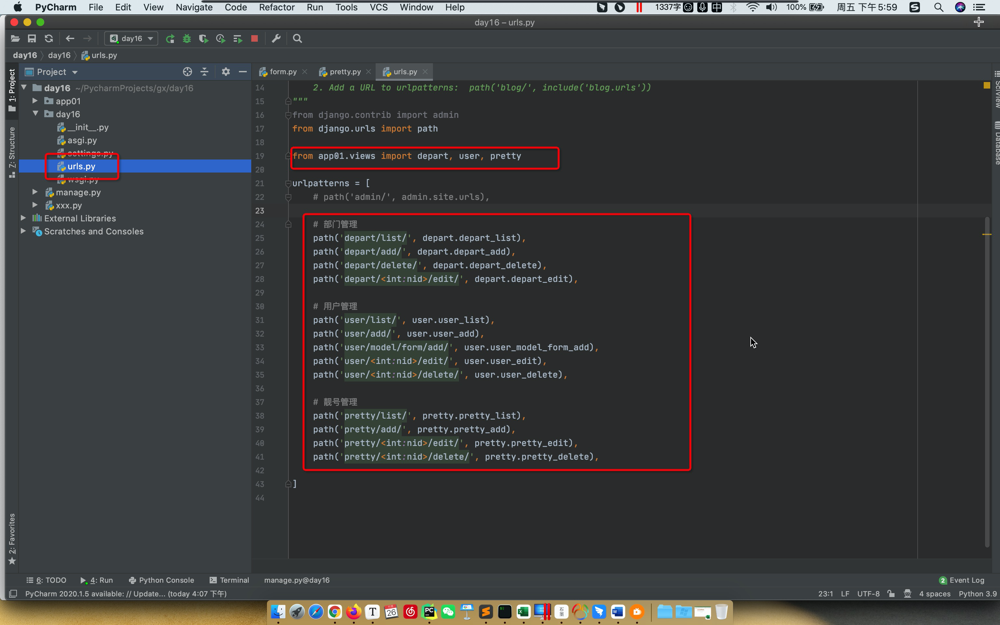

    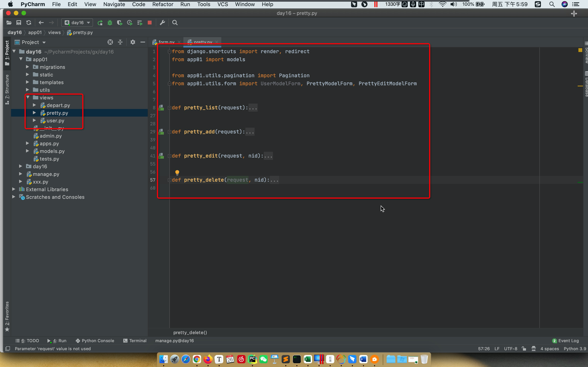
  * ## 操作

    * ModelForm可以帮助我们生成HTML标签。

      ```python
      class UserModelForm(forms.ModelForm):
          class Meta:
              model = models.UserInfo
              fields = ["name", "password",]

      form = UserModelForm()
      ```

      ```html
      {{form.name}}      普通的input框
      {{form.password}}  普通的input框
      ```
    * 定义插件

      ```python
      class UserModelForm(forms.ModelForm):
          class Meta:
              model = models.UserInfo
              fields = ["name", "password",]
              widgets = {
                  "name": forms.TextInput(attrs={"class": "form-control"}),
                  "password": forms.PasswordInput(attrs={"class": "form-control"}),
                  "age": forms.TextInput(attrs={"class": "form-control"}),
              }
      ```

      ```python

      class UserModelForm(forms.ModelForm):
          name = forms.CharField(
              min_length=3,
              label="用户名",
              widget=forms.TextInput(attrs={"class": "form-control"})
          )

          class Meta:
              model = models.UserInfo
              fields = ["name", "password", "age"]
      ```

      ```html
      {{form.name}}      BootStrap的input框
      {{form.password}}  BootStrap的input框
      ```
    * 重新定义的init方法，批量设置

      ```python
      class UserModelForm(forms.ModelForm):
          class Meta:
              model = models.UserInfo
              fields = ["name", "password", "age",]

          def __init__(self, *args, **kwargs):
              super().__init__(*args, **kwargs)

              # 循环ModelForm中的所有字段，给每个字段的插件设置
              for name, field in self.fields.items():
      			field.widget.attrs = {
                      "class": "form-control", 
                      "placeholder": field.label
                  }
      ```

      ```python
      class UserModelForm(forms.ModelForm):
          class Meta:
              model = models.UserInfo
              fields = ["name", "password", "age",]

          def __init__(self, *args, **kwargs):
              super().__init__(*args, **kwargs)

              # 循环ModelForm中的所有字段，给每个字段的插件设置
              for name, field in self.fields.items():
                  # 字段中有属性，保留原来的属性，没有属性，才增加。
                  if field.widget.attrs:
      				field.widget.attrs["class"] = "form-control"
      				field.widget.attrs["placeholder"] = field.label
                  else:
                      field.widget.attrs = {
                          "class": "form-control", 
                          "placeholder": field.label
                      }
      ```

      ```python
      class UserEditModelForm(forms.ModelForm):
          class Meta:
              model = models.UserInfo
              fields = ["name", "password", "age",]

          def __init__(self, *args, **kwargs):
              super().__init__(*args, **kwargs)

              # 循环ModelForm中的所有字段，给每个字段的插件设置
              for name, field in self.fields.items():
                  # 字段中有属性，保留原来的属性，没有属性，才增加。
                  if field.widget.attrs:
      				field.widget.attrs["class"] = "form-control"
      				field.widget.attrs["placeholder"] = field.label
                  else:
                      field.widget.attrs = {
                          "class": "form-control", 
                          "placeholder": field.label
                      }
      ```
    * 自定义类

      ```python
      class BootStrapModelForm(forms.ModelForm):
          def __init__(self, *args, **kwargs):
              super().__init__(*args, **kwargs)
              # 循环ModelForm中的所有字段，给每个字段的插件设置
              for name, field in self.fields.items():
                  # 字段中有属性，保留原来的属性，没有属性，才增加。
                  if field.widget.attrs:
      				field.widget.attrs["class"] = "form-control"
      				field.widget.attrs["placeholder"] = field.label
                  else:
                      field.widget.attrs = {
                          "class": "form-control", 
                          "placeholder": field.label
                      }
      ```

      ```python
      class UserEditModelForm(BootStrapModelForm):
          class Meta:
              model = models.UserInfo
              fields = ["name", "password", "age",]

      ```
    * 就是所有views里的类都继承用modelform写好的类

      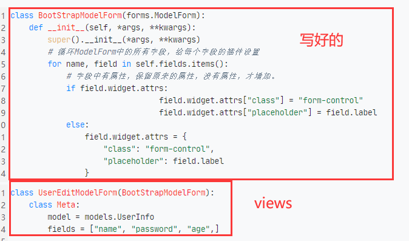
    * 然后可能就是views里的class（form）太多了，那可以单独把所有的form都写到一个文件里面，然后要用的时候引入即可
    * 如果views里的函数太多，也可以重新建一个文件夹分开来写

      像这样

      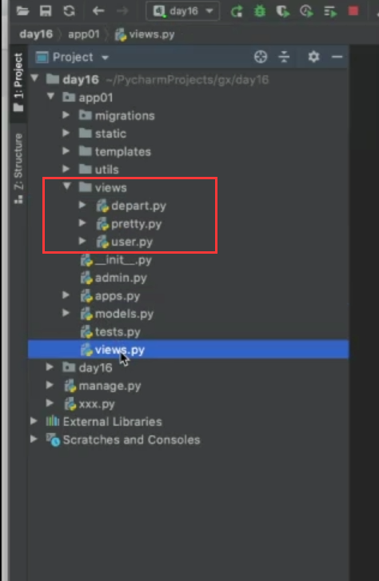

      然后注意要取修改一下路由就行了
