* 新建管理员

  * 密码数据校验

    * form.clean_data 如果校验成功，这个里面就是所有的正确数据
    * 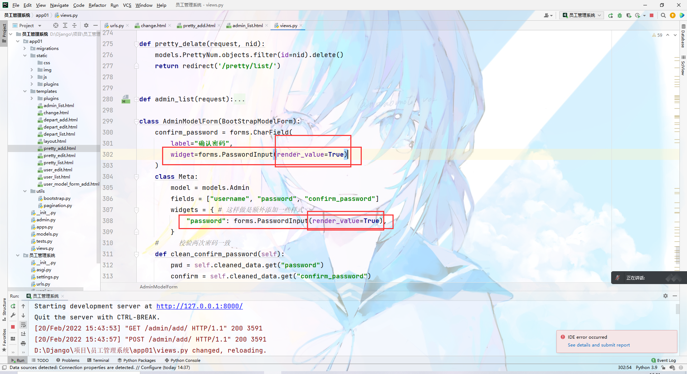

      * 密码不一致报错后不会被清空
  * 密码md5加密

    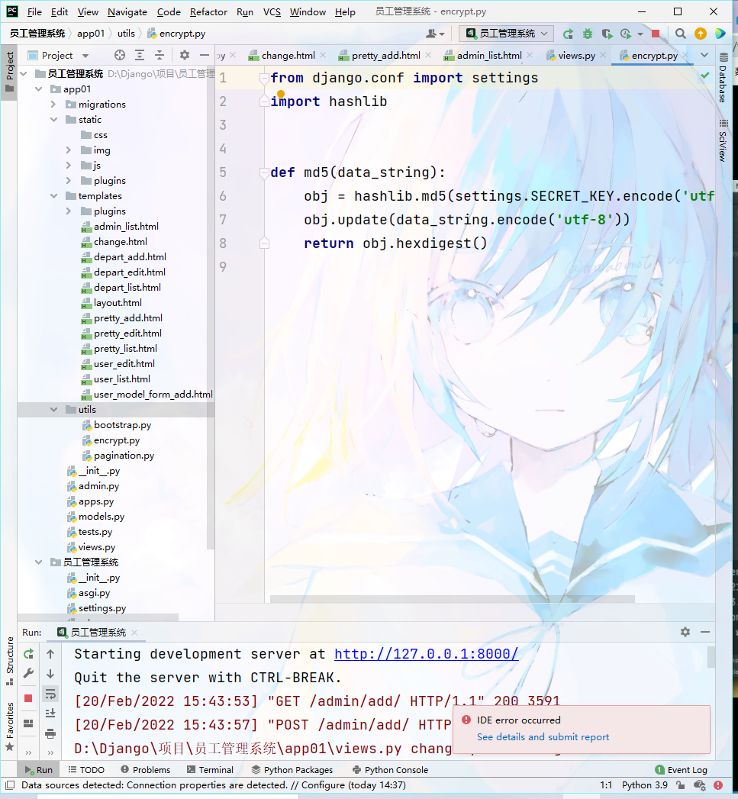

    * 使用时直接引入，当成函数用
* 重置管理员密码

  * 在页面中加上对应的表头和超链接
  * 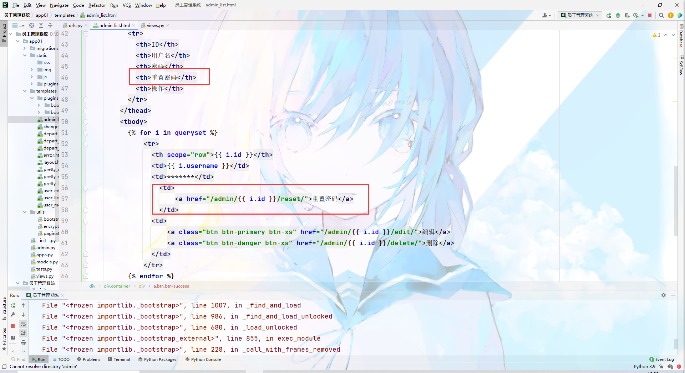
* 密码与之前的一样会报错

  * 写在类里面
  * 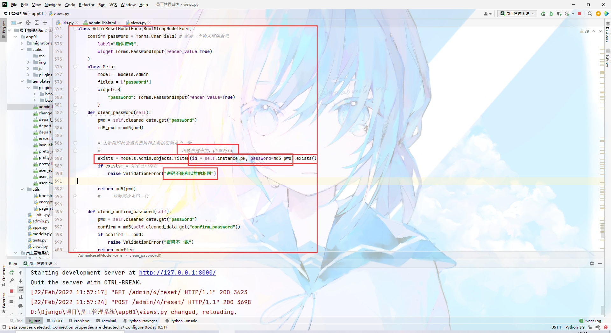
* 个性化重置密码页面

  * 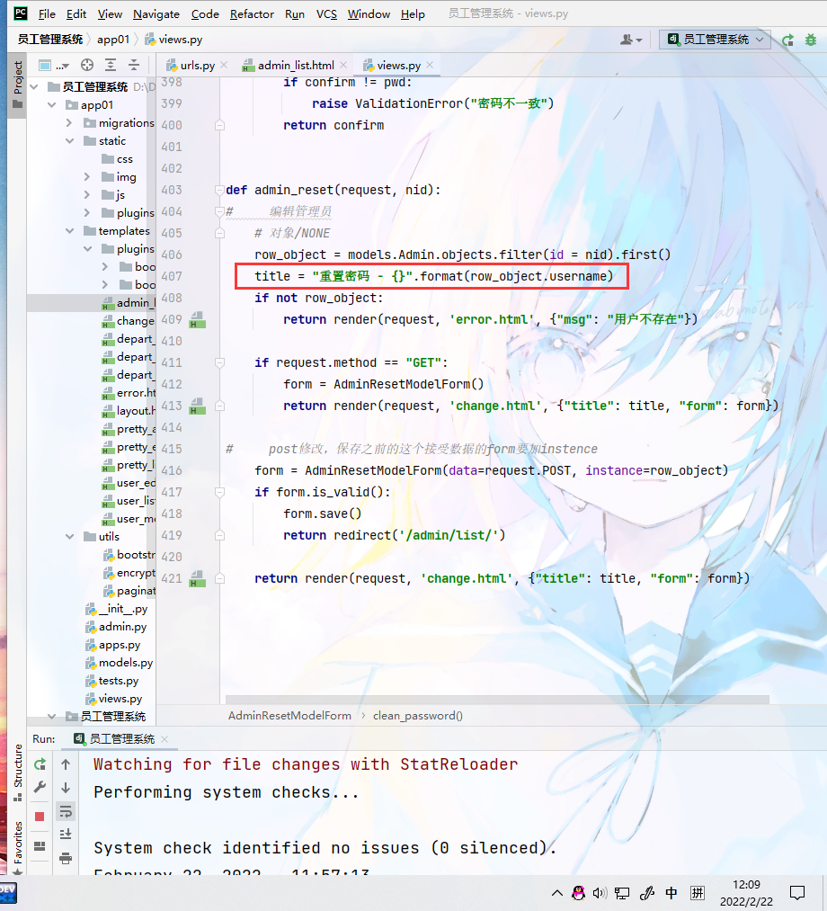
  * 这样就可以看出是重置谁的密码
* 关于重置密码

  * 重置密码时不应该看见之前的密码
  * 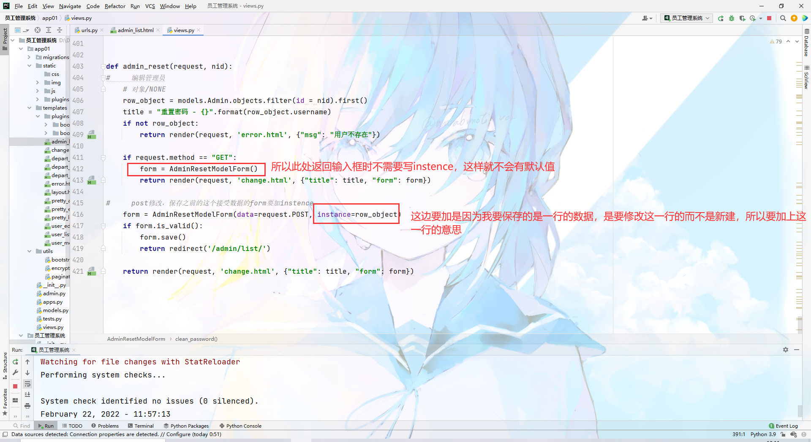
* 登录

  * cookie和session

    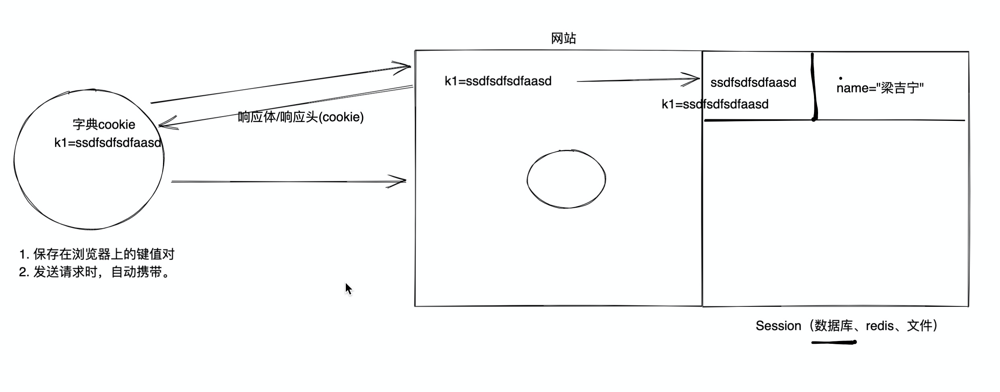

    * 大概就是要登陆的话就是通过登录向网站发送请求，也就是向网站发送一个随机字符串，

    * 然后通过该字符串去网站的库中找有没有对应的，

    * 然后有的话就再去后面找对应的信息，然后返回，就根据这个信息来显示账户
    * 然后浏览器也会记住网址上的该操作，下次可以直接登录。
    * 那个库就是session，可以这么理解
    * 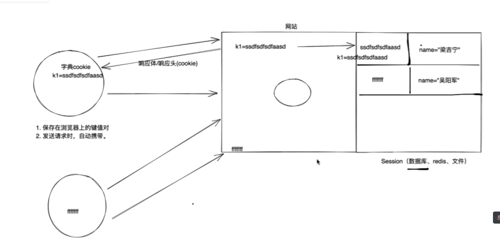
  * URL

    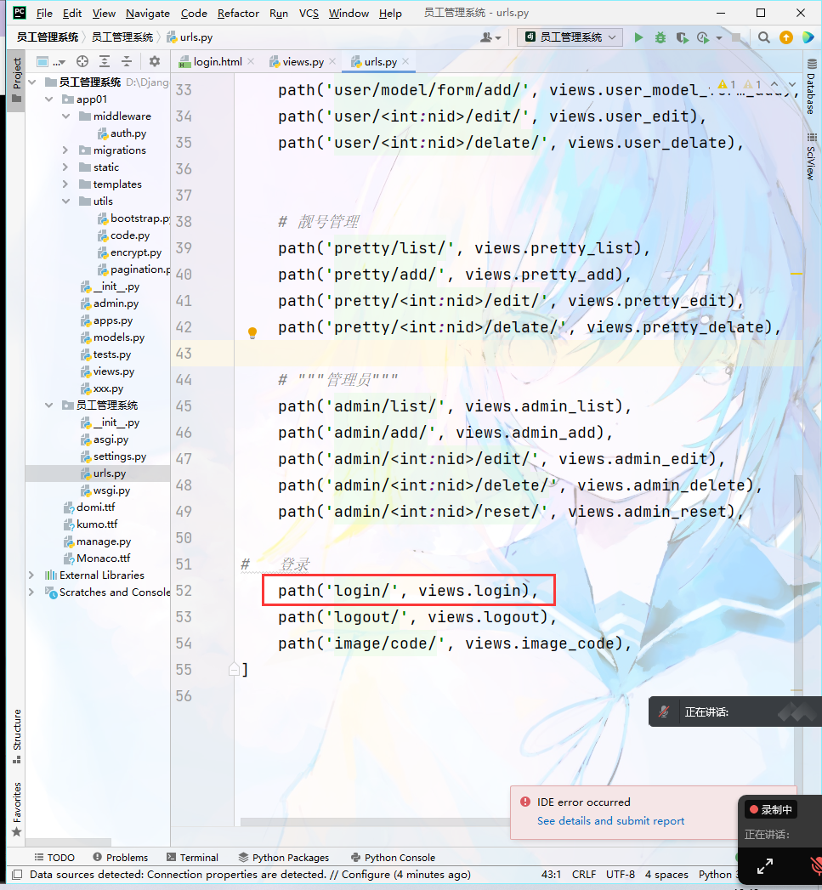
  * 页面（模板）

    ```html
    
    <!DOCTYPE html>
    <html lang="en">
    <head>
        <meta charset="UTF-8">
        <title>Title</title>
        <script src="https://ajax.aspnetcdn.com/ajax/jQuery/jquery-3.2.1.min.js"></script>
        <script src=""></script>
        <script src=""></script>
        <link rel="stylesheet" href="">

        <style>
            .account {
                width: 400px;
                border: 1px solid #dddddd;
                border-radius: 5px;
                box-shadow: 5px 5px 20px #aaa;

                margin-left: auto;
                margin-right: auto;
                margin-top: 100px;
                padding: 20px 40px;
            }

            .account h2 {
                margin-top: 10px;
                text-align: center;
            }
        </style>
    </head>
    <body>
    <div class="account">
        <h2>用户登录</h2>
    {#                      不让浏览器做校验#}
        <form method="post" novalidate>
            
            <div class="form-group">
                <label>用户名</label>
    {#            <input type="email" class="form-control" id="exampleInputEmail1" placeholder="用户名">#}
                {{ form.username }}
                <span style="color: red;">{{ form.username.errors.0 }}</span>
            </div>
            <div class="form-group">
                <label>密码</label>
    {#            <input type="password" class="form-control" id="exampleInputPassword1">#}
                {{ form.password }}
                <span style="color: red;">{{ form.password.errors.0 }}</span>
            </div>
            <div class="form-group">
                <label for="id_code">图片验证码</label>
                <div class="row">
                    <div class="col-xs-7">
                        {{ form.code }}
                        <span style="color: red;">{{ form.code.errors.0 }}</span>
                    </div>
                    <div class="col-xs-5">
                        
                    </div>
                </div>
            </div>
            <input type="submit" value="登 录" class="btn btn-primary">
        </form>
    </div>

    </body>
    </html>
    ```
  * 函数

    * 通过Form来实现输入框

      * 要自己写所有字段
      * 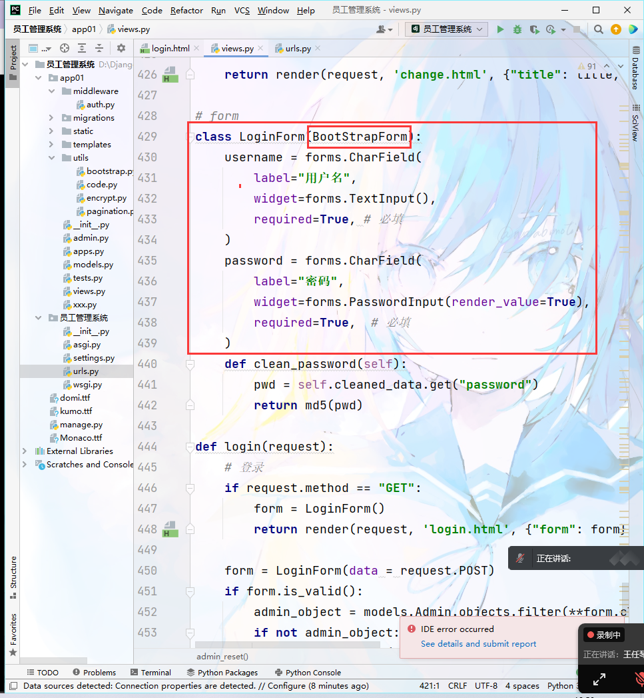
      * 然后在Form和ModelForm的那个样式继承中

        * 把效果函数单独写
        * 然后分别再写两个类，都继承样式，然后两个分别继承Bootstrap
        * ```python
          from django import forms


          class BootStrap:
              def __init__(self, *args, **kwargs):
                  super().__init__(*args, **kwargs)
                  # 循环ModelForm中的所有字段，给每个字段的插件设置
                  for name, field in self.fields.items():
                      # 字段中有属性，保留原来的属性，没有属性，才增加。
                      if field.widget.attrs:
                          field.widget.attrs["class"] = "form-control"
                          field.widget.attrs["placeholder"] = field.label
                      else:
                          field.widget.attrs = {
                              "class": "form-control",
                              "placeholder": field.label
                          }

          # 这个是ModelForm
          class BootStrapModelForm(BootStrap, forms.ModelForm):
              pass

          # 这个是Form
          class BootStrapForm(BootStrap, forms.Form):
              pass

          ```
      * 这样写的时候，就可以直接继承相应的了，注意要先引入
    * 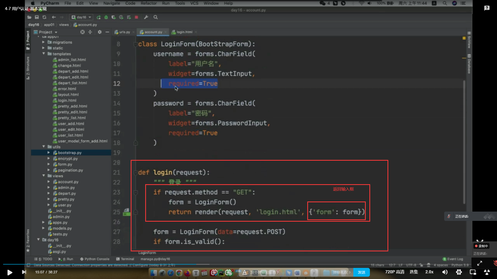
    * 获取数据

      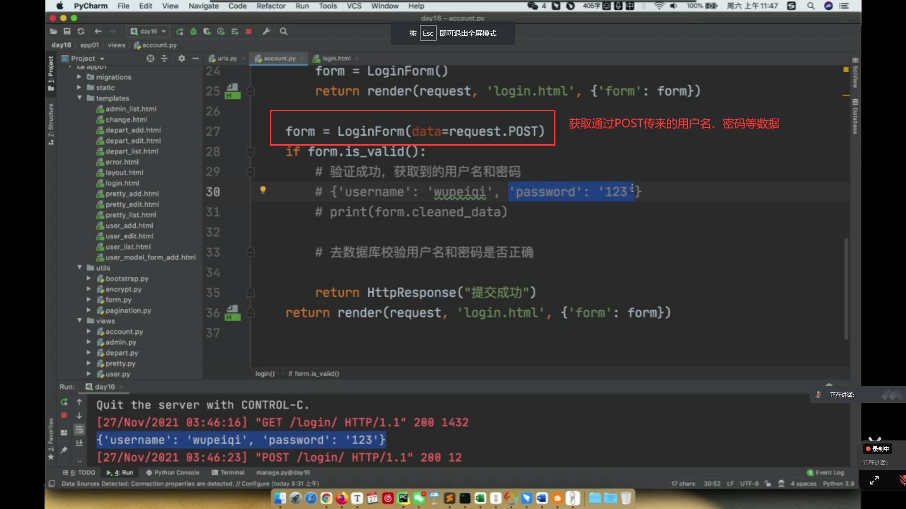
    * Form中没有save
    * 要去数据库校验数据

      * 因为数据库中的密码是密文
      * 所以我们获取的密码也需要转成md五格式才能去数据库找到
      * 就在Form中写一个函数，直接把密码改成加密形式
      * 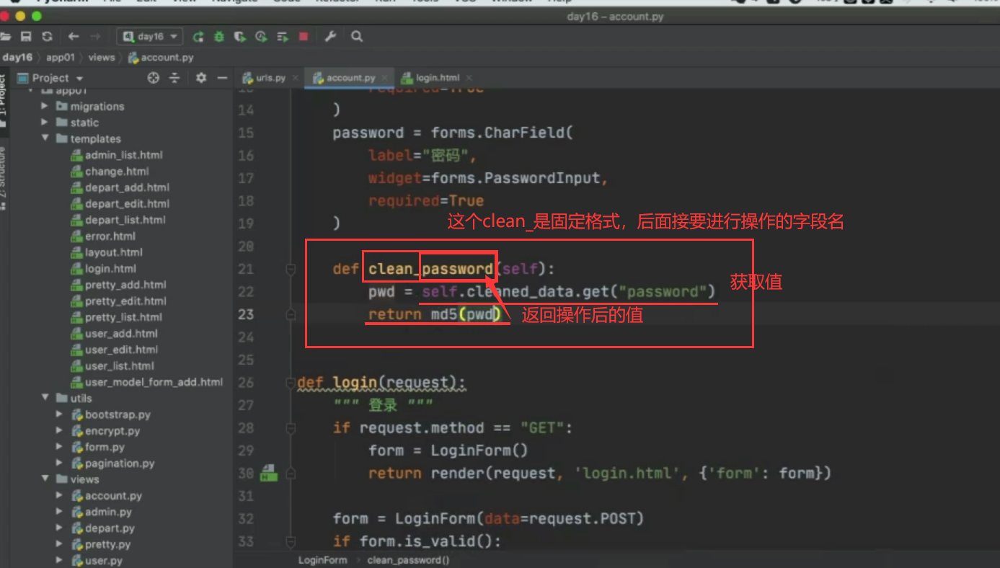
      * 接着就要去数据库中找了

        * 原理

          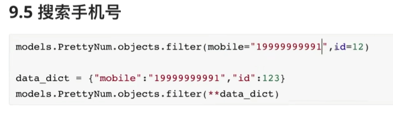

          写一个字典，把要找的字段名和对应的数据写进去，然后找的时候再filter中写字典名前面加两个`*`即可。
        * clean_data 返回的就是校验成功以后的数据，是一个字典
        * 然后这么写时需要键和数据库中的一致
        * 所以在代码中

          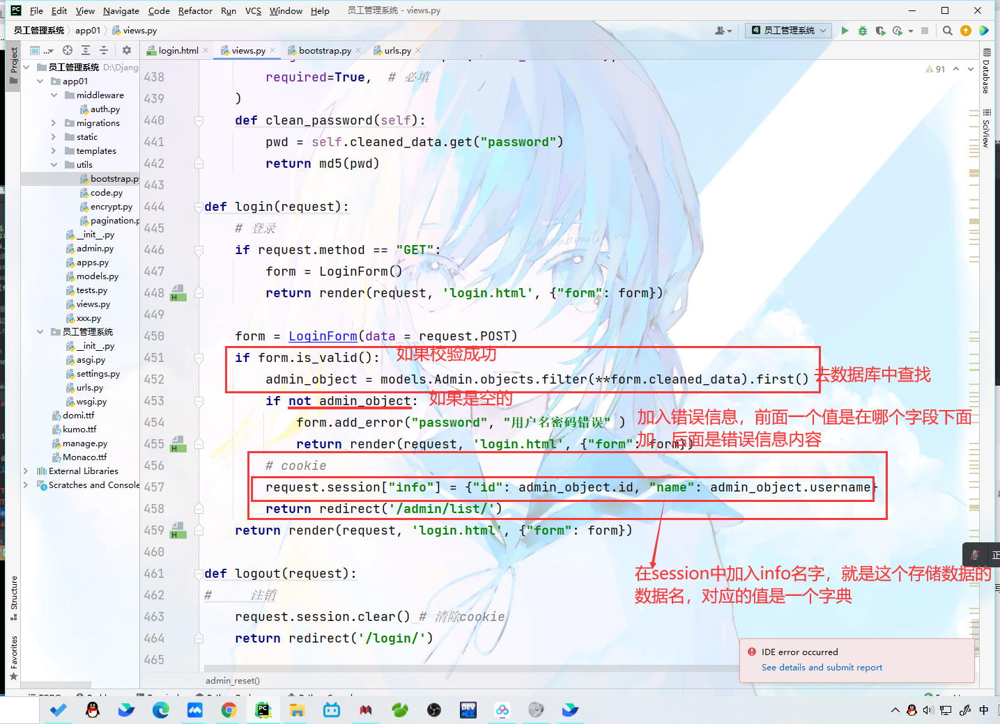
      * 如果校验错误，就是找不到错误

        * 手动添加错误

          
        * 报错返回后为了防止密码消失不见

          在Form 插件中写

          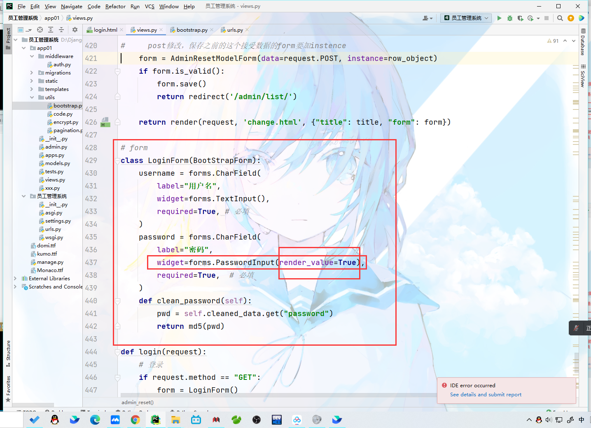

          这样密码就还会显示
    * 接着就用基于Django自带的功能Session，把用户信息写入session中

      * 代码

        
      * 先把登录的数据校验成功
      * 就是直接帮助我们接受用户请求以后生成一个随机字符串，然后这个字符串作为键值，后台数据库中会有以这个字符串为索引的用户信息

      * 然后用户也会接受这个字符串后就显示以后端信息对应的界面
      * 后端信息实际上是个字典
      * 那个Info实际上是后端数据的名字，包含了所有的字典什么的
      * 然后回把获取的登录数据放到后台，就是Info中
      * Info代指一个字典

        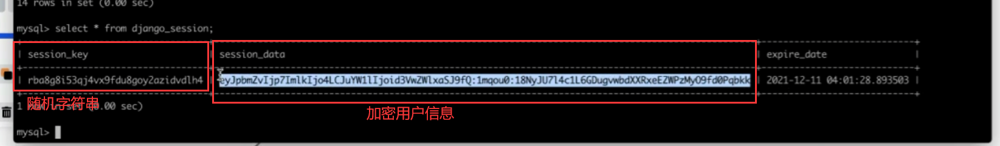
      * 一个随机字符串可能就代表一个用户吧，还不太理解
      * ```python
        request.session["info"] = {"id": admin_object.id, "name": admin_object.username}
        ```
  * 中间件【一个类】

    * 调用每个URL函数前都必须执行的功能
    * 功能：只有登录了才能看到相应的页面
    * 原理

      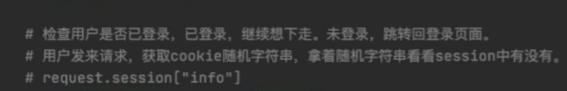

    * 原本

      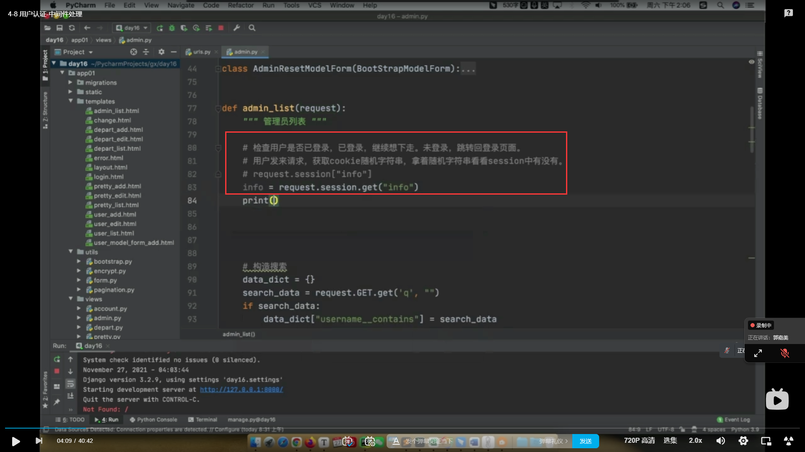

      上面就是获取**当前用户**（随机字符串）的session库中存的Info

      * 代码

        就是如果获取到的info为空就说明没有登录，就重定向回登陆页面

        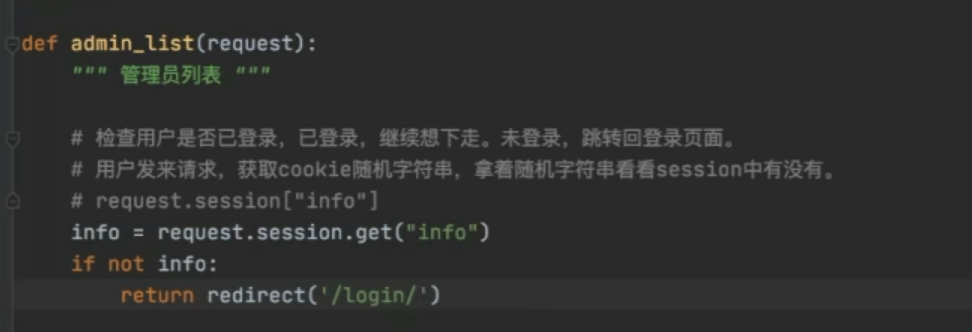
      * 按这种操作方式应该在每个def函数中都写上，太麻烦了
    * 所以就用中间件写
    * 每个中间件有一个进去的和一个出来的，按setting里设置的顺序进，再反过来出，一旦哪一环除了问题就会从哪一环直接出，是栈的顺序。

      * 

        * 定义中间件

          ```python
          from django.utils.deprecation import MiddlewareMixin
          from django.shortcuts import HttpResponse

          class M1(MiddlewareMixin):
              """ 中间件1 """

              def process_request(self, request):

                  # 如果方法中没有返回值（返回None），继续向后走
                  # 如果有返回值 HttpResponse、render 、redirect
                  print("M1.process_request")
                  return HttpResponse("无权访问")

              def process_response(self, request, response):
                  print("M1.process_response")
                  return response


          class M2(MiddlewareMixin):
              """ 中间件2 """

              def process_request(self, request):
                  print("M2.process_request")

              def process_response(self, request, response):
                  print("M2.process_response")
                  return response
          ```
        * 应用中间件 setings.py

          ```python
          MIDDLEWARE = [
              'django.middleware.security.SecurityMiddleware',
              'django.contrib.sessions.middleware.SessionMiddleware',
              'django.middleware.common.CommonMiddleware',
              'django.middleware.csrf.CsrfViewMiddleware',
              'django.contrib.auth.middleware.AuthenticationMiddleware',
              'django.contrib.messages.middleware.MessageMiddleware',
              'django.middleware.clickjacking.XFrameOptionsMiddleware',
              'app01.middleware.auth.M1',
              'app01.middleware.auth.M2',
          ]
          ```
        * 在中间件的process_request方法

          ```python
          # 如果方法中没有返回值（返回None），继续向后走
          # 如果有返回值 HttpResponse、render 、redirect，则不再继续向后执行。
          ```
    * 功能实现

      * 代码
      * 编写中间件

        ```python
        from django.utils.deprecation import MiddlewareMixin
        from django.shortcuts import HttpResponse, redirect


        class AuthMiddleware(MiddlewareMixin):

            def process_request(self, request):
                # 0.排除那些不需要登录就能访问的页面
                #   request.path_info 获取当前用户请求的URL /login/
                if request.path_info == "/login/":
                    return

                # 1.读取当前访问的用户的session信息，如果能读到，说明已登陆过，就可以继续向后走。
                info_dict = request.session.get("info")
                print(info_dict)
                if info_dict:
                    return

                # 2.没有登录过，重新回到登录页面
                return redirect('/login/')
        ```
      * 应用中间件

        在在settings里面添加

        ```python
        MIDDLEWARE = [
            'django.middleware.security.SecurityMiddleware',
            'django.contrib.sessions.middleware.SessionMiddleware',
            'django.middleware.common.CommonMiddleware',
            'django.middleware.csrf.CsrfViewMiddleware',
            'django.contrib.auth.middleware.AuthenticationMiddleware',
            'django.contrib.messages.middleware.MessageMiddleware',
            'django.middleware.clickjacking.XFrameOptionsMiddleware',
            'app01.middleware.auth.AuthMiddleware',
        ]
        ```
      * 就是如果转到登录页面也需要先登录的话就会陷入死循环，所以我们提前特判掉
      * 通过`request.path_info` 获取要访问函数的URL，如果该URL等于'/login'，就直接return后返回登陆页面
      * 如果不写返回函数的话说明应该就是返回时没有要求，就直接返回
* 注销用户

  * 就是删除session中的数据
  * URL

    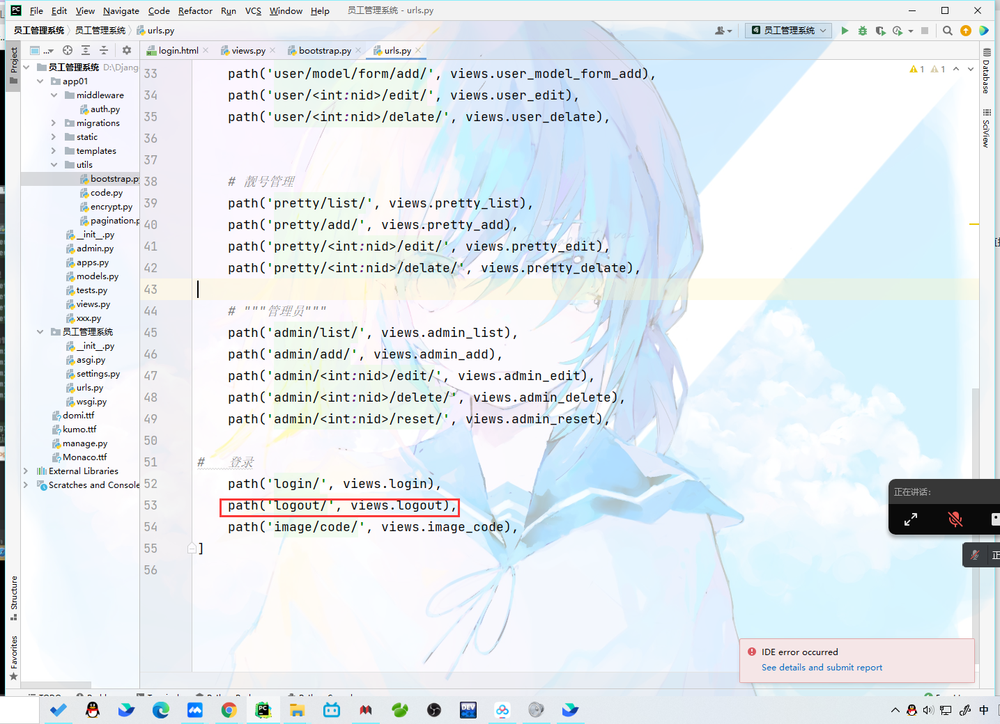
  * 函数

    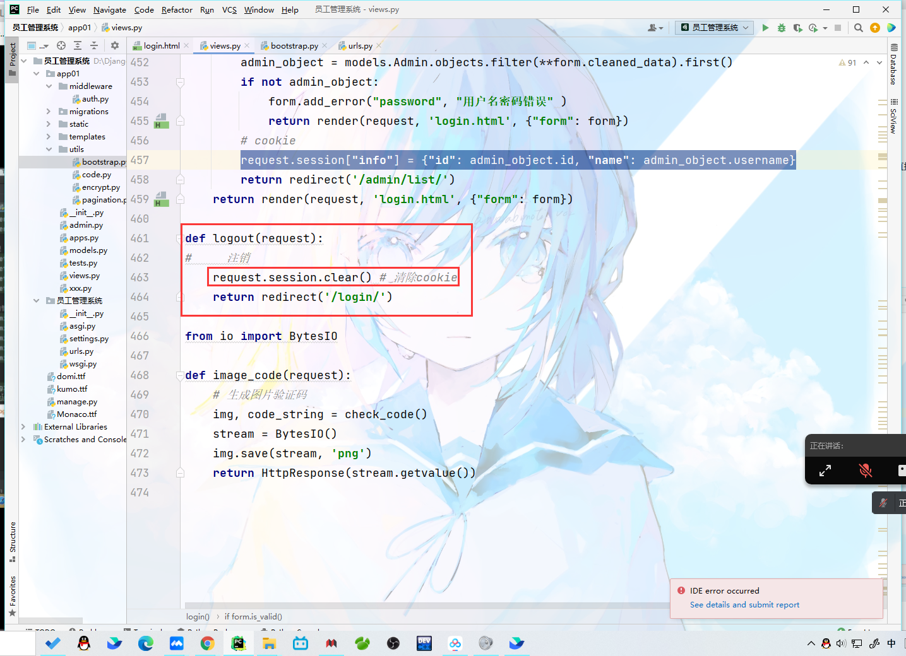

    通过请求参数获取session，然后删除
  * 视图

    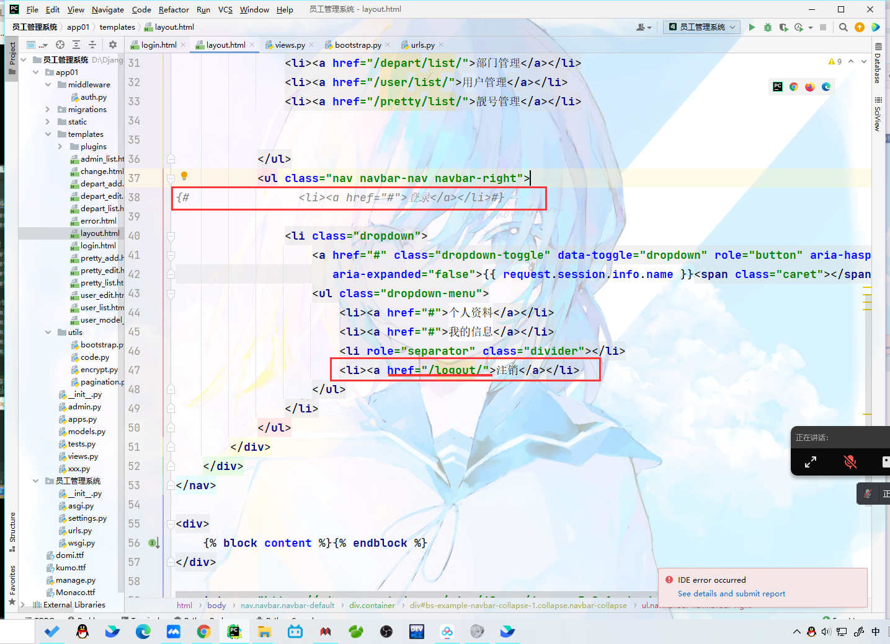

    修改模板中的注销链接

    然后把之前写死的那个登录给删掉即可
* 验证码

  * 安装模块

    `pip install pillow`
  * 关于该模块画图的用法

    **[点这里](https://www.cnblogs.com/wupeiqi/articles/5812291.html)**
  * 生成图片

    类型是彩色，尺寸是120-30，颜色是白色（255，255，255）

    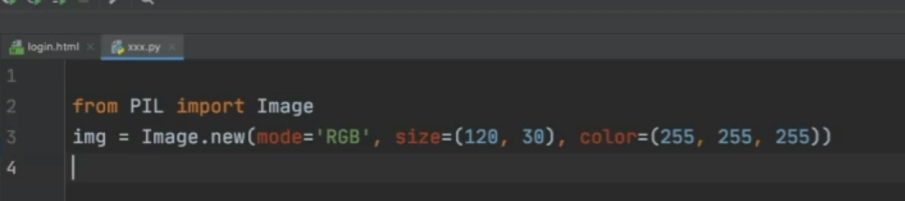
  * 保存图片

    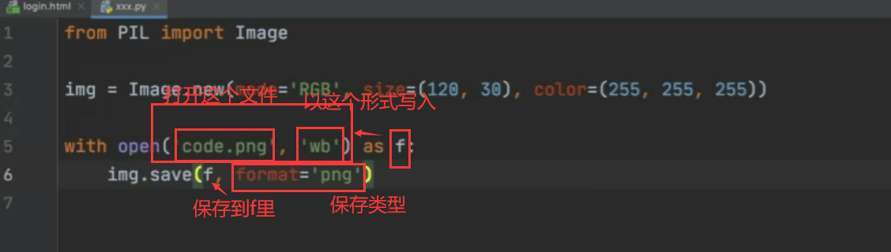
  * 创建画笔，在图上画东西

    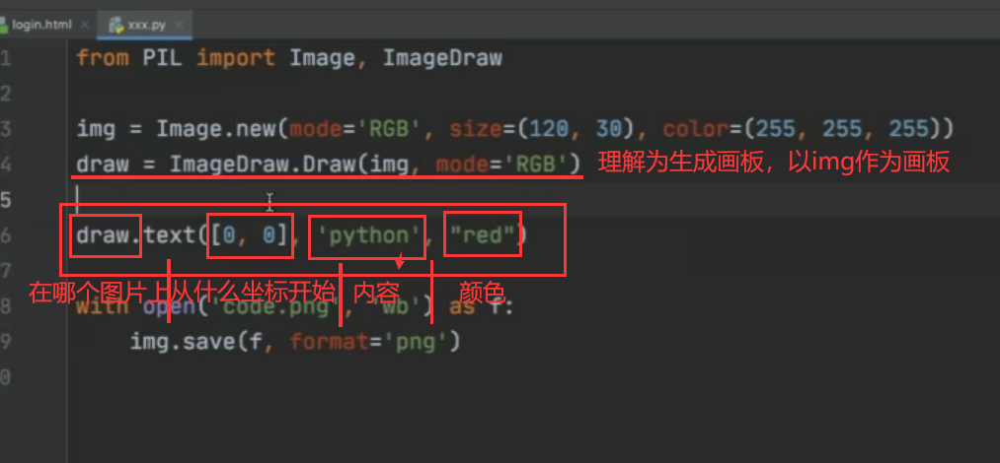
  * 文件中需要包含字体文件

    [Monaco.ttf](assets/Monaco-20220225215720-9q84x3z.ttf)  
    [domi.ttf](assets/domi-20220225215720-s477j6g.ttf)  
    [kumo.ttf](assets/kumo-20220225215720-be4xn2d.ttf)

    * 用法：

      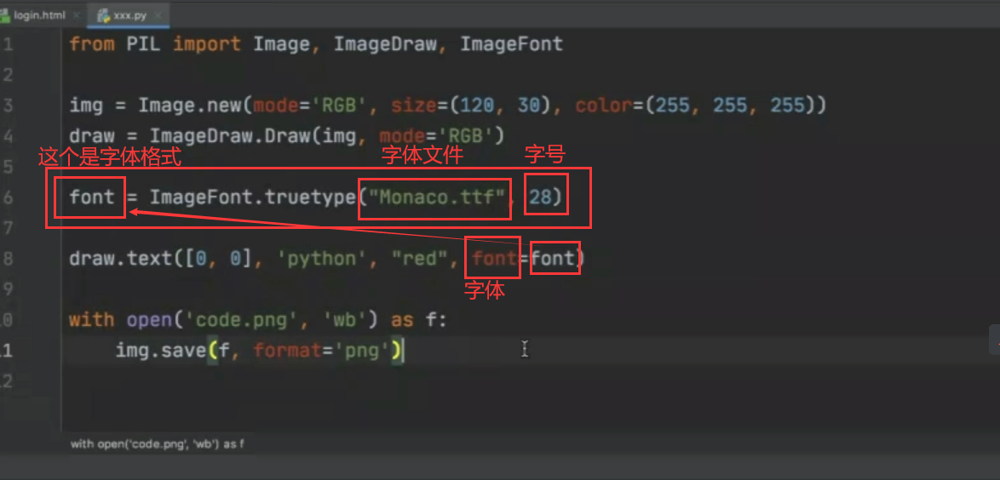
  * 上面是原理
  * 当我们真正需要验证码时，只要直接用一个写好的函数即可

    ```python
    import random
    from PIL import Image, ImageFont, ImageDraw, ImageFilter

    def check_code(width=120, height=30, char_length=5, font_file='kumo.ttf', font_size=28):
        code = []
        img = Image.new(mode='RGB', size=(width, height), color=(255, 255, 255))
        draw = ImageDraw.Draw(img, mode='RGB')

        def rndChar():
            """
            生成随机字母
            :return:
            """
            return chr(random.randint(65, 90))

        def rndColor():
            """
            生成随机颜色
            :return:
            """
            return (random.randint(0, 255), random.randint(10, 255), random.randint(64, 255))

        # 写文字
        font = ImageFont.truetype(font_file, font_size)
        for i in range(char_length):
            char = rndChar()
            code.append(char)
            h = random.randint(0, 4)
            draw.text([i * width / char_length, h], char, font=font, fill=rndColor())

        # 写干扰点
        for i in range(40):
            draw.point([random.randint(0, width), random.randint(0, height)], fill=rndColor())

        # 写干扰圆圈
        for i in range(40):
            draw.point([random.randint(0, width), random.randint(0, height)], fill=rndColor())
            x = random.randint(0, width)
            y = random.randint(0, height)
            draw.arc((x, y, x + 4, y + 4), 0, 90, fill=rndColor())

        # 画干扰线
        for i in range(5):
            x1 = random.randint(0, width)
            y1 = random.randint(0, height)
            x2 = random.randint(0, width)
            y2 = random.randint(0, height)

            draw.line((x1, y1, x2, y2), fill=rndColor())

        img = img.filter(ImageFilter.EDGE_ENHANCE_MORE)
        return img, ''.join(code)

    ```
  * URL

    用这个来返回图片验证码

    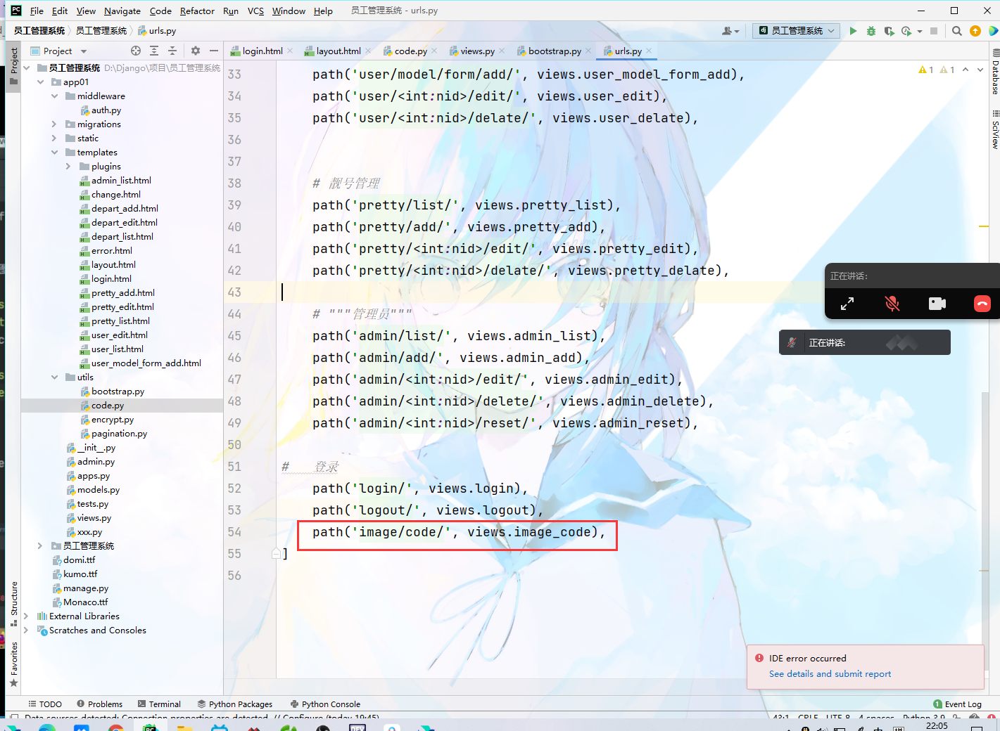
  * 视图

    图片通过链接来获取，而不是本地图片

    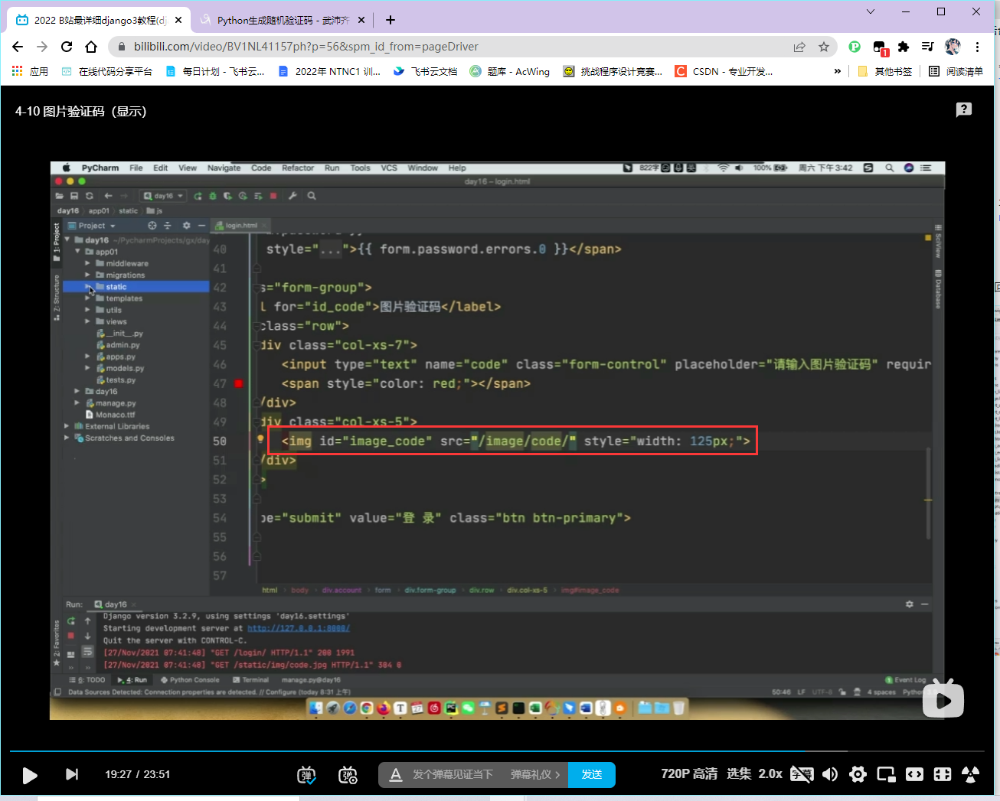
  * 函数

    要执行该函树一定是在未登录时的，所以该链接也需要加入执行中间件特判

    在特判中搞一个列表

    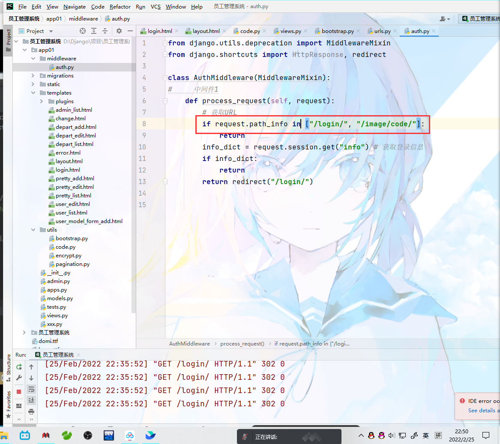

    在该函数中调用生成验证码的函数

    * **函数**

      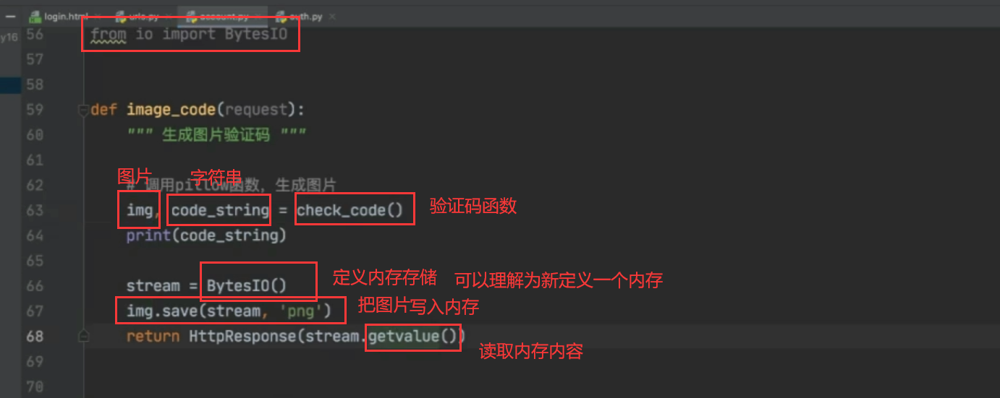
* 验证码的校验

  * 把生成图片之前生成的字符串验证码写入到session里，并设置为60秒过期

    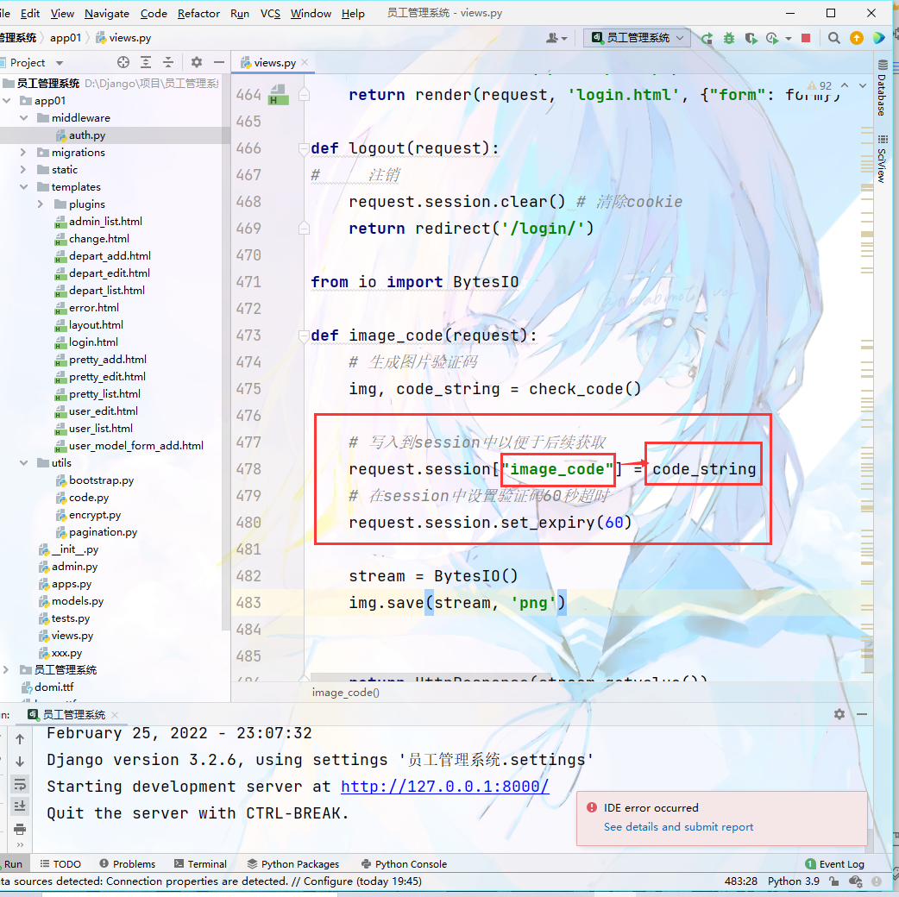
  * 函数

    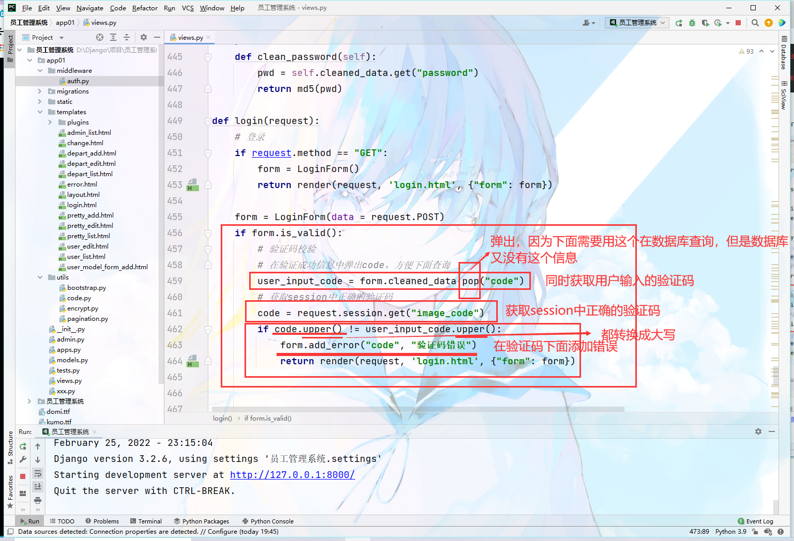
  * 因为之前设置了sessin60秒过期，所以需要充值一下过期时间，不然60s就要重新登录一次，太麻烦了

    60\*60\*24\*7 是一周的秒数

    所以设置为7天过期

    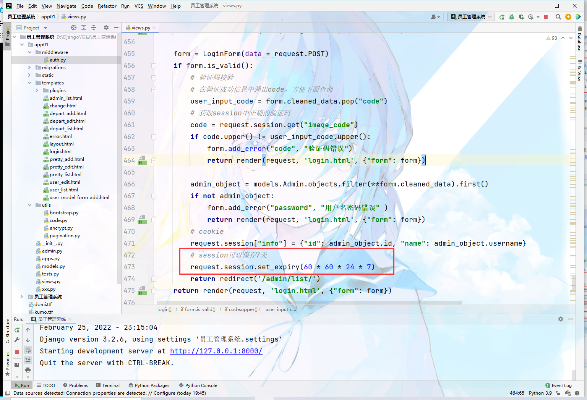

　　

　　

　　

　　

　　
