* # 浏览器向网站发送请求时：URL 和 表单的形式提交。

  * ## GET
  * ## POST

* # 特点：页面刷新。

* 除此之外，也可以基于Ajax向后台发送请求（偷偷的发送请求）。

* # 依赖jQuery
* # 编写ajax代码

  ```javascript
  $.ajax({
      url:"发送的地址",
      type:"get",
      data:{
          n1:123,
          n2:456
      },
      success:function(res){
          console.log(res);
      }
  })
  ```
* 就相当于通过按钮发送请求，就不是form了
* 然后在页面中写一个按钮
* 按钮绑定事件，然后在下面写ajax 函数

  按钮

  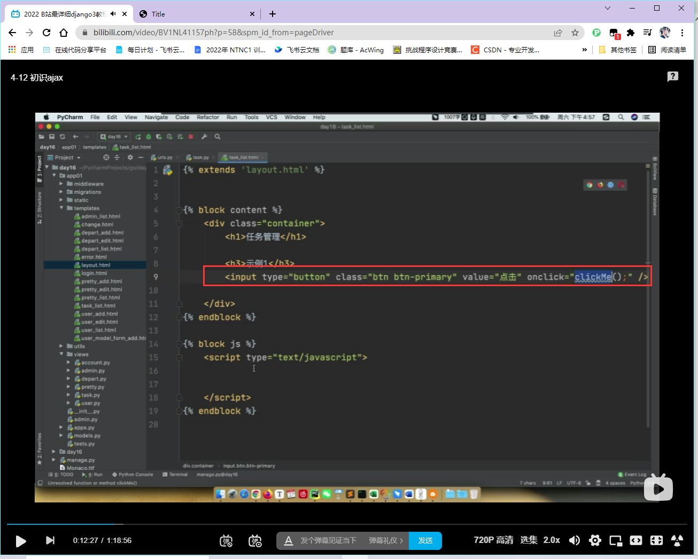

  ajax

  

  后面的是执行成功以后的东西
* 后台根据这种方式来获取数据

  
* 以上是get请求
* # 这样写即可免除CSRF_TOKEN

  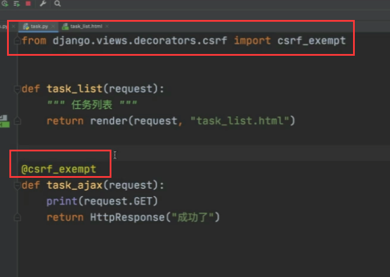

  因为ajax发送POST请求时需要，但又比较复杂
* # 也可以通过另一种方式来绑定事件

  给按钮一个名称id

  写的时候`$("#btn1").click(function ()`

  ```javascript
  


  
      <div class="container">
          <h1>任务管理</h1>

          <h3>示例1</h3>
          <input id="btn1" type="button" class="btn btn-primary" value="点击"/>

      </div>
  

  
      <script type="text/javascript">
          $(function () {
              // 页面框架加载完成之后代码自动执行
              bindBtn1Event();

          })

          function bindBtn1Event() {
              $("#btn1").click(function () {
                  $.ajax({
                      url: '/task/ajax/',
                      type: "post",
                      data: {
                          n1: 123,
                          n2: 456
                      },
                      success: function (res) {
                          console.log(res);
                      }
                  })
              })
          }

      </script>
  

  ```

* # 一般都会返回JSON格式。

  

  ```html
  


  
      <div class="container">
          <h1>任务管理</h1>

          <h3>示例1</h3>
          <input id="btn1" type="button" class="btn btn-primary" value="点击"/>

      </div>
  

  
      <script type="text/javascript">
          $(function () {
              // 页面框架加载完成之后代码自动执行
              bindBtn1Event();

          })

          function bindBtn1Event() {
              $("#btn1").click(function () {
                  $.ajax({
                      url: '/task/ajax/',
                      type: "post",
                      data: {
                          n1: 123,
                          n2: 456
                      },
                      dataType: "JSON",
                      success: function (res) {
                          console.log(res);
                          console.log(res.status);
                          console.log(res.data);
                      }
                  })
              })
          }

      </script>
  
  ```

  ```python
  import json
  from django.shortcuts import render, HttpResponse
  from django.http import JsonResponse
  from django.views.decorators.csrf import csrf_exempt


  def task_list(request):
      """ 任务列表 """
      return render(request, "task_list.html")


  @csrf_exempt
  def task_ajax(request):
      print(request.GET)
      print(request.POST)

      data_dict = {"status": True, 'data': [11, 22, 33, 44]}
      return HttpResponse(json.dumps(data_dict))
  ```
* # 加上这个使获取的数据变成方便调用的对象

  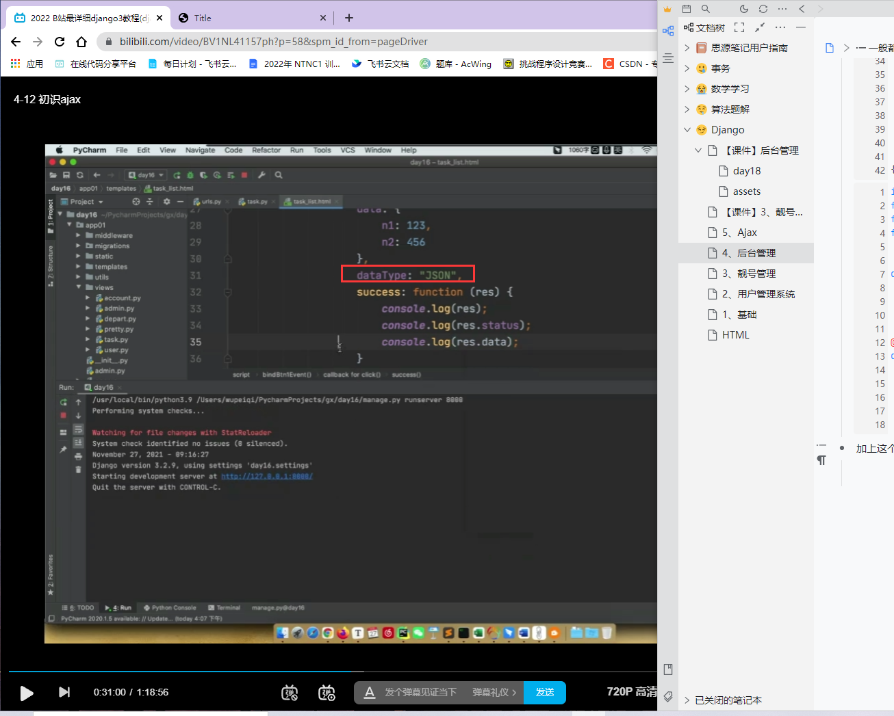
* # 提交表单

  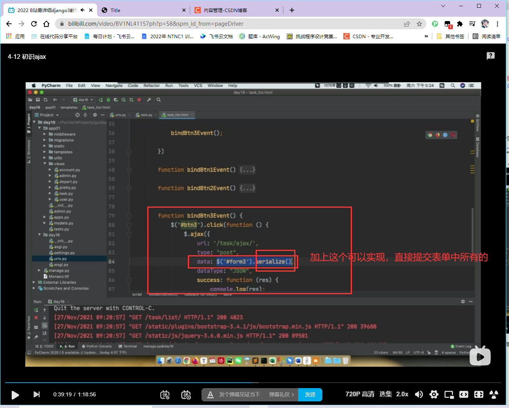
* # 关联数据表选项显示内容

  

  
* # 使按钮和事件绑定

  * ## 方法一

    * ### 通过点击

      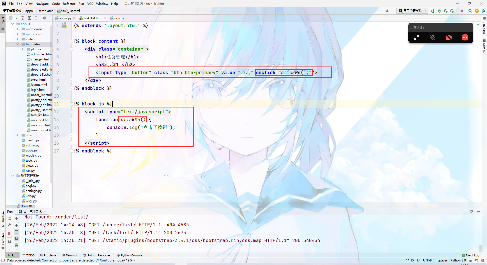
  * ## 方法二（jQery）

    * ### 先给按钮一个id

      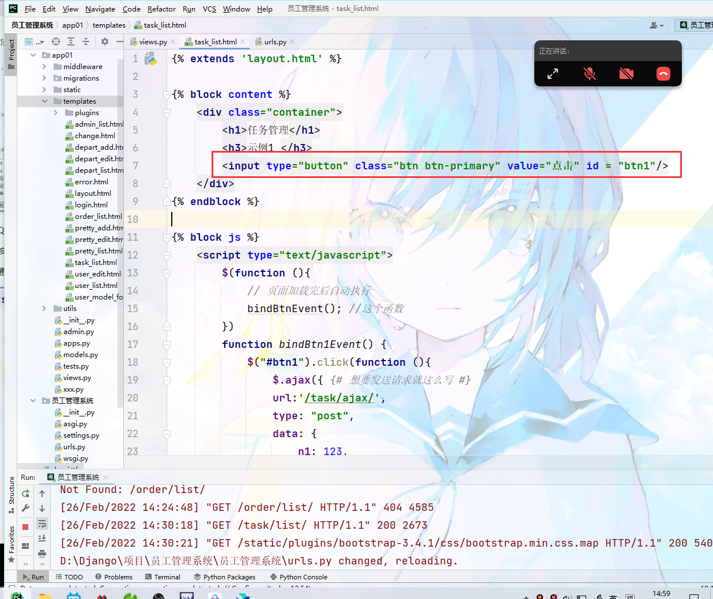
    * ### 然后通过id去函数里对应

      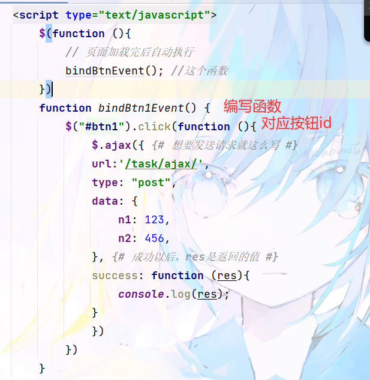
* # GET请求

  * ## 要想发送请求就这么写：

    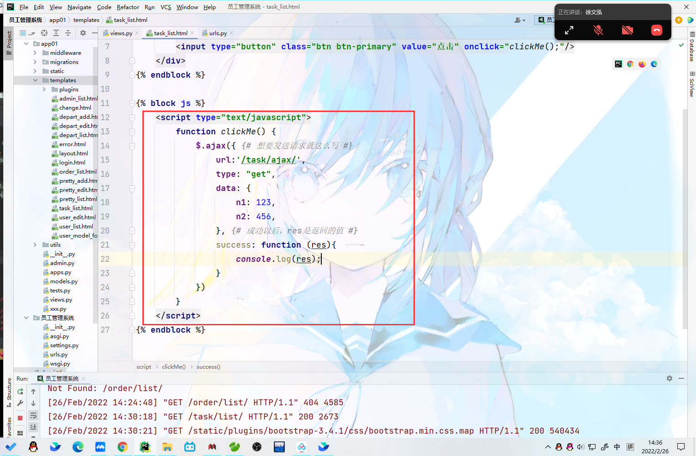
  * ## 函数返回什么，res就是什么

    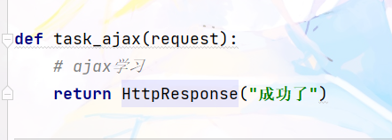
  * ## 可以理解成就是原本通过页面访问URL来使用函数变成了通过按钮＋绑定事件来调用函数
  * ## 后端这么获取前端传来的值

    
* # POST请求

  * ## 免除CSRF认证

    * ### 引入，然后在函数前面加@

      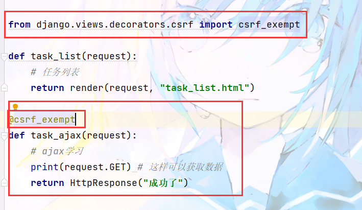
  * ## 获取数据

    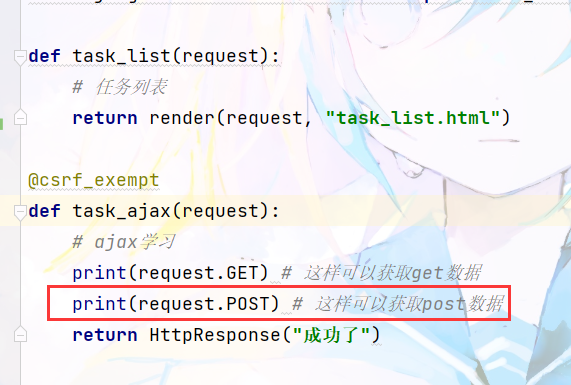
* # 返回数据格式

  * ### 一般都会返回JSON格式。

    #### 解决办法

    
  * 可是像上面那样前端接受的其实是一个字符串，为了方便取值

    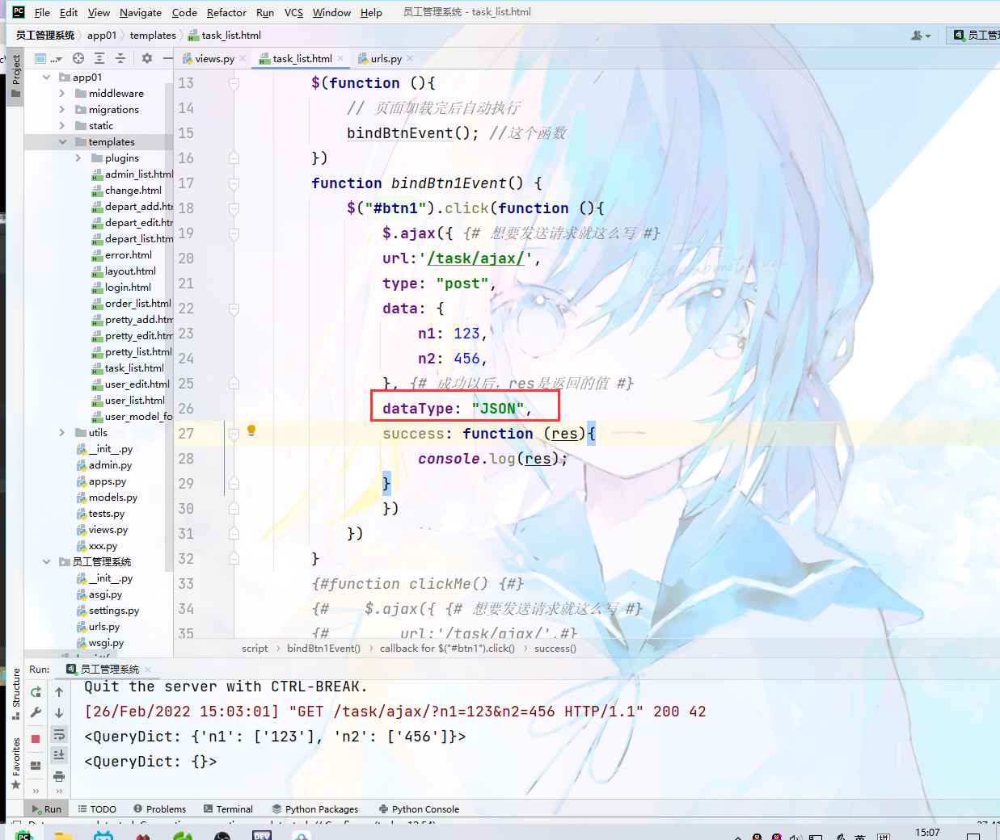
  * 然后这样就可以把值取出来

    
* # 把input框中输入的值传入后台

  * 输入框

    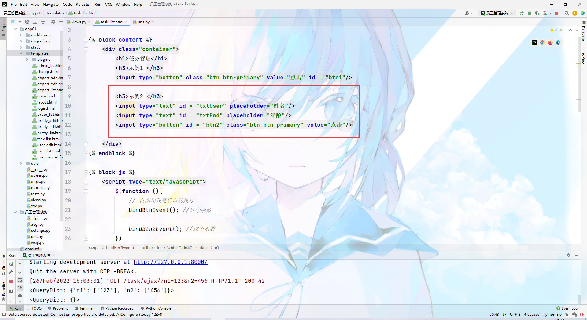
  * 要想把那个数据传到后台

    通过这种方式获取对应标签里的值

    
  * 把form里的所有数据传到后端

    

    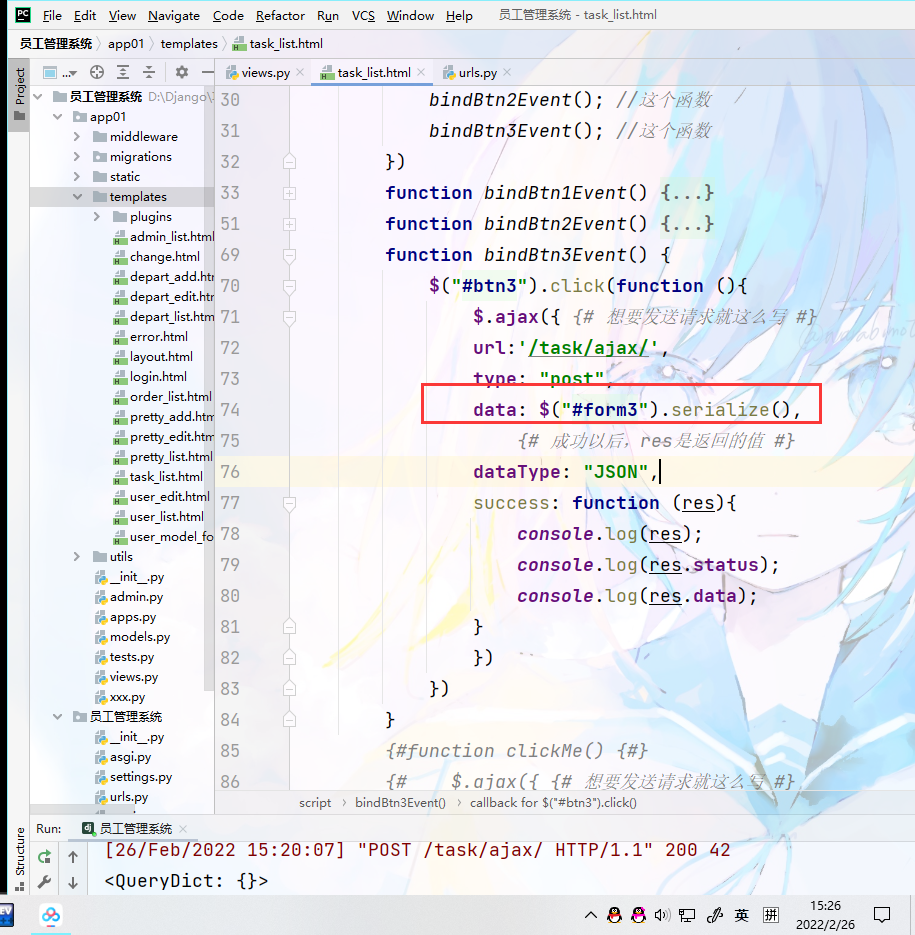
* # 任务管理

  * ## modelform

    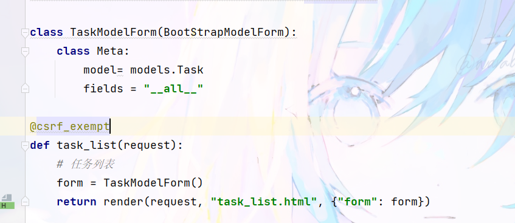
  * ## 视图

    ```js
    

    
        <div class="container">
            <h1>任务管理</h1>

            <div class="panel panel-default">
                <div class="panel-heading">表单</div>
                <div class="panel-body">
                    <form method="post" novalidate>
                        
                            <div class="form-group">
                                <label>{{ field.label }}</label>
                                {{ field }}
                            </div>
                        

                        <button type="submit" class="btn btn-primary">提 交</button>
                    </form>
                </div>
            </div>


            <hr>
            <h1>Ajax学习</h1>
            <h3>示例1 </h3>
            <input type="button" class="btn btn-primary" value="点击" id = "btn1"/>

            <h3>示例2 </h3>
            <input type="text" id = "txtUser" placeholder="姓名"/>
            <input type="text" id = "txtAge" placeholder="年龄"/>
            <input type="button" id = "btn2" class="btn btn-primary" value="点击"/>

            <h3>示例3 </h3>
            <form id = "form3">
                <input type="text" name = "user" placeholder="姓名"/>
                <input type="text" name = "age" placeholder="年龄"/>
                <input type="text" name = "email" placeholder="邮箱"/>
                <input type="text" name = "more" placeholder="介绍"/>
                <input type="button" id = "btn3" class="btn btn-primary" value="点击"/>
            </form>
        </div>
    

    

        <script type="text/javascript">
            $(function (){
                // 页面加载完后自动执行,然后依次找所对应的
                bindBtn1Event(); //这个函数
                bindBtn2Event(); //这个函数
                bindBtn3Event(); //这个函数
            })
            function bindBtn1Event() {
                $("#btn1").click(function (){
                    $.ajax({ {# 想要发送请求就这么写 #}
                    url:'/task/ajax/',
                    type: "post",
                    data: {
                        n1: 123,
                        n2: 456,
                    }, {# 成功以后，res是返回的值 #}
                    dataType: "JSON",
                    success: function (res){
                        console.log(res);
                        console.log(res.status);
                        console.log(res.data);
                    }
                    })
                })
            }
            function bindBtn2Event() {
                $("#btn2").click(function (){
                    $.ajax({ {# 想要发送请求就这么写 #}
                    url:'/task/ajax/',
                    type: "post",
                    data: {
                        name: $("#txtUser").val(),
                        age: $("#txtAge").val(),
                    }, {# 成功以后，res是返回的值 #}
                    dataType: "JSON",
                    success: function (res){
                        console.log(res);
                        console.log(res.status);
                        console.log(res.data);
                    }
                    })
                })
            }
            function bindBtn3Event() {
                $("#btn3").click(function (){
                    $.ajax({ {# 想要发送请求就这么写 #}
                    url:'/task/ajax/',
                    type: "post",
                    data: $("#form3").serialize(),
                        {# 成功以后，res是返回的值 #}
                    dataType: "JSON",
                    success: function (res){
                        console.log(res);
                        console.log(res.status);
                        console.log(res.data);
                    }
                    })
                })
            }
            {#function clickMe() {#}
            {#    $.ajax({ {# 想要发送请求就这么写 #}
            {#        url:'/task/ajax/',#}
            {#        type: "post",#}
            {#        data: {#}
            {#            n1: 123,#}
            {#            n2: 456,#}
            {#        }, {# 成功以后，res是返回的值 #}
            {#        success: function (res){#}
            {#            console.log(res);#}
            {#        }#}
            {#    })#}
            {# }#}
        </script>
    

    ```
  * ## ajax实现添加功能

    * 给form加id
    * 给提交按钮加id
    * 然后通过ajax把值传到后端

      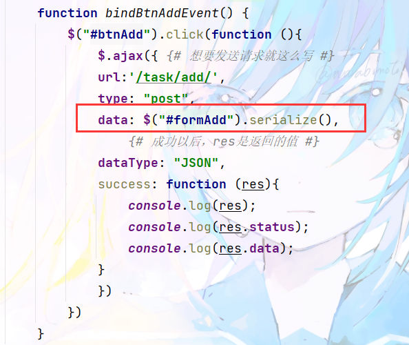

    * 打印错误，这样其实就是把错误填进错误的
    * 通过循环展示出错误信息

      循环每个字段，然后把该字段下的第一个错误信息加到下一行去

      
    * ### 函数

      ```py
      @csrf_exempt
      def task_add(request):
      #     添加任务
          print(request.POST)
          form = TaskModelForm(data = request.POST) # 通过modelform获取数据
          if form.is_valid():
              form.save() # 保存
              data_dict = {"status": True} # 返回状态
              return HttpResponse(json.dumps(data_dict))
          data_dict = {"status": False, "error": form.errors} # 返回错误信息
          return HttpResponse(json.dumps(data_dict, ensure_ascii=False))# 和错误状态
      ```
  * ## 在页面上实时显示列表

    * ### 在页面上加上列表

      ```html
      {#        任务列表#}
              <div class="panel panel-default">
               <div class="panel-heading">
                <span class="glyphicon glyphicon-th-list" aria-hidden="true"></span> {# 图标 #}
                任务列表
              </div>
              <table class="table table-bordered">
              <thead>
                <tr>
                  <th>ID</th>
                  <th>标题</th>
                  <th>级别</th>
                  <th>负责人</th>
                  <th>操作</th>
                </tr>
              </thead>
              <tbody>
                
                    <tr>
                      <th scope="row">{{ i.id }}</th>
                      <td>{{ i.title }}</td>
                      <td>{{ i.get_level_display }}</td>
                      <td>{{ i.user.username }}</td>
                      <td>
                          <a class="btn btn-primary btn-xs" href="/admin/{{ i.id }}/edit/">编辑</a>
                          <a class="btn btn-danger btn-xs" href="/admin/{{ i.id }}/delete/">删除</a>
                      </td>
                    </tr>
                
              </tbody>
            </table>
          </div>
      ```
    * ### 给列表加上分页

      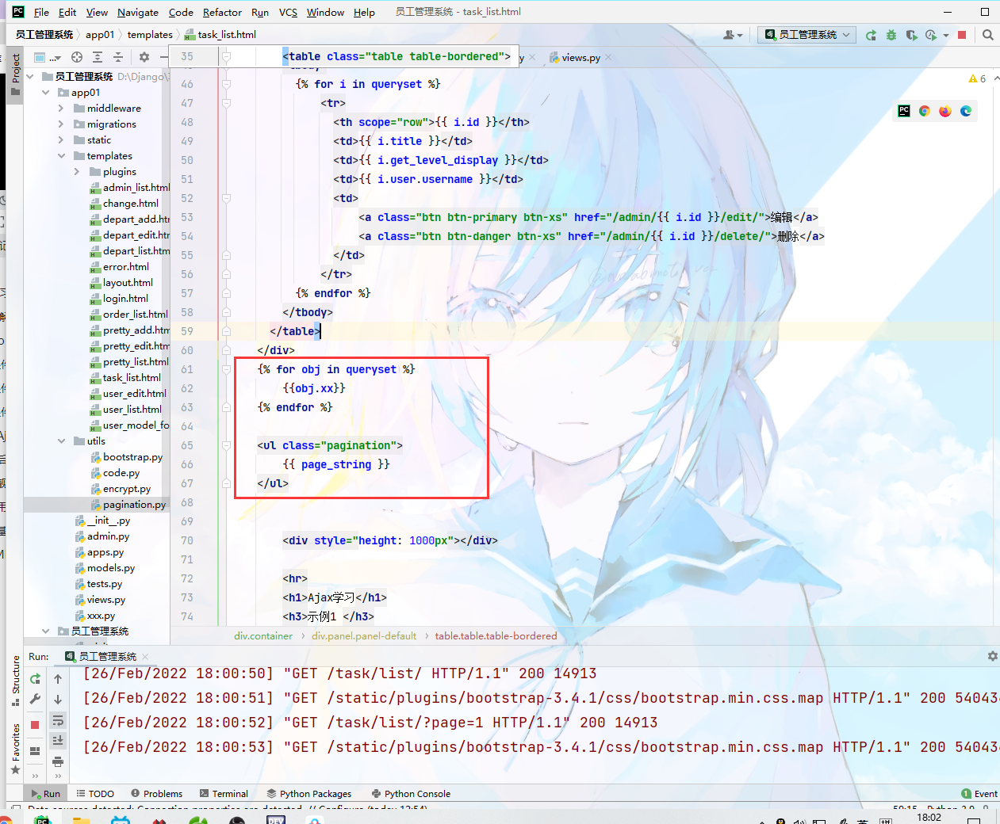

      
    * ### 实时刷新

      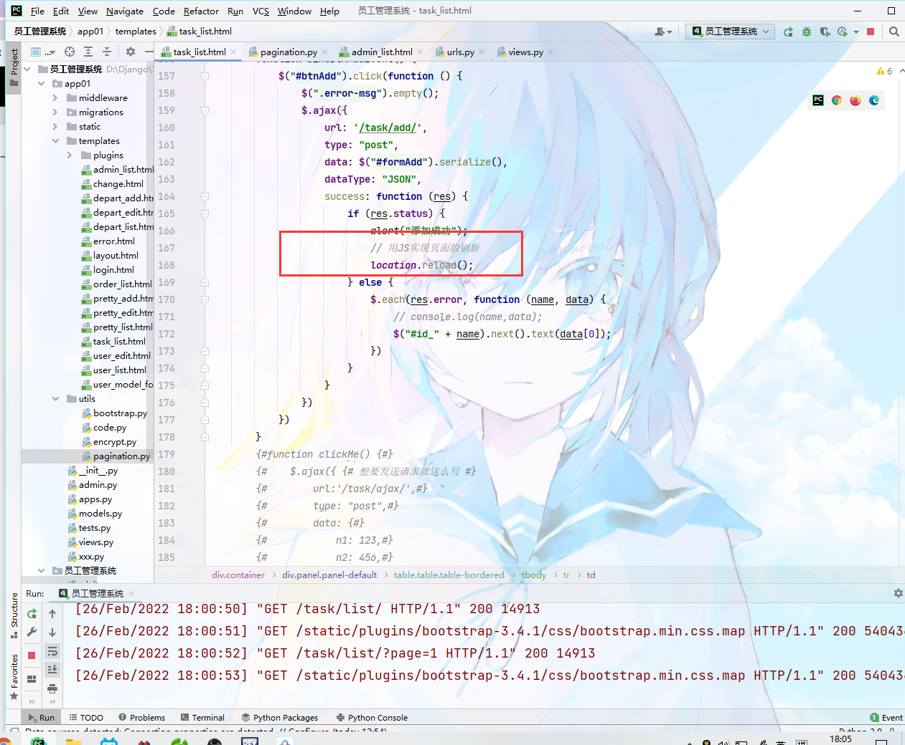

　　

　　
