* # 对话框

  * ## 对话框页面和按钮关联也是通过id
  * ## 按钮

    ```html
                <input type="button" value="新建订单" class="btn btn-primary" data-toggle="modal" data-target="#myModal">
    ```
  * ## 对话框

    ```html
    {#    新建对话框#}
        <div class="modal fade" id="myModal" tabindex="-1" role="dialog" aria-labelledby="myModalLabel">
          <div class="modal-dialog" role="document">
            <div class="modal-content">
              <div class="modal-header">
                <button type="button" class="close" data-dismiss="modal" aria-label="Close"><span aria-hidden="true">&times;</span></button>
                <h4 class="modal-title" id="myModalLabel">Modal title</h4>
              </div>
              <div class="modal-body">
                ...
              </div>
              <div class="modal-footer">
                <button type="button" class="btn btn-default" data-dismiss="modal">Close</button>
                <button type="button" class="btn btn-primary">Save changes</button>
              </div>
            </div>
          </div>
        </div>
    ```
  * ## 方法二

    通过给按钮一个id，来显示

    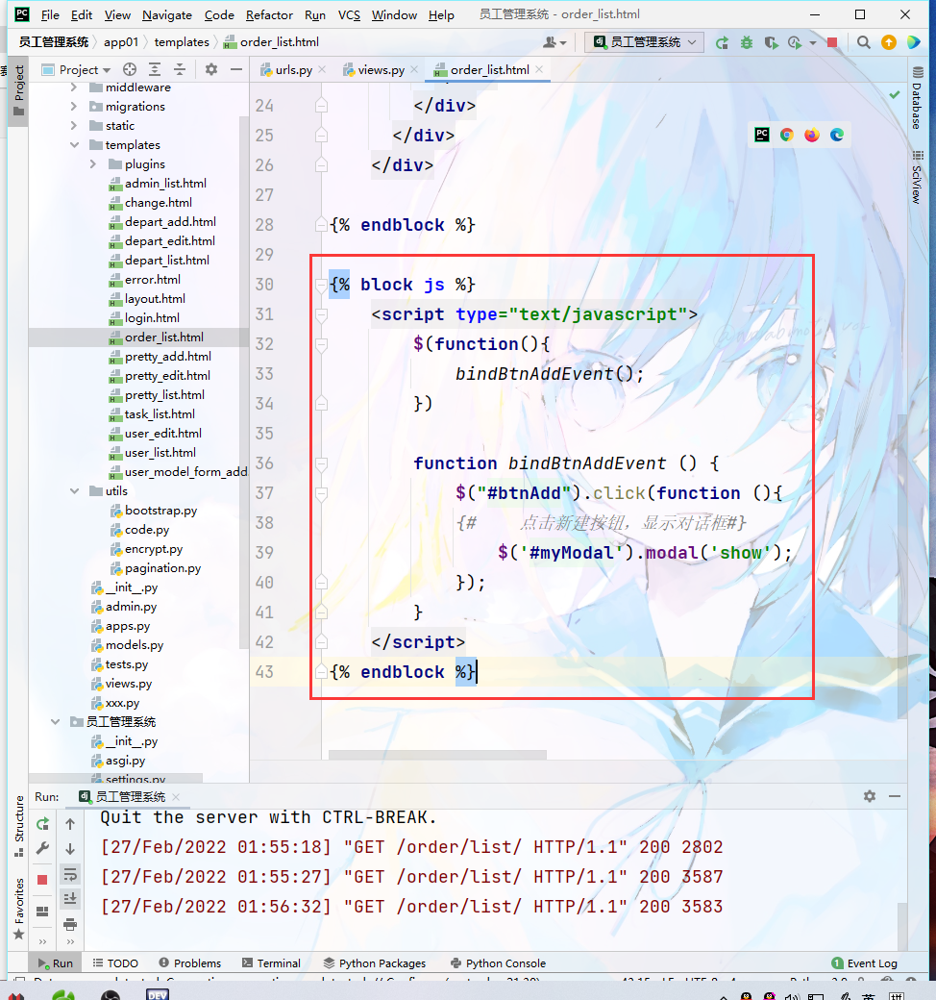
* # 事件+随机字符串

  ```django
          form.instance.oid = datetime.now().strftime("%Y%m%d%H%M%S") + str(random.randint(1000, 9999))
  ```
* # 获取session中的用户id

  ```django
          form.instance.admin_id = request.session["info"]["id"]
  ```
* # 添加成功以后清空表单

  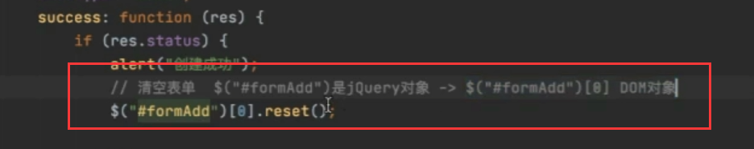
* # 添加成功以后关闭对话框

  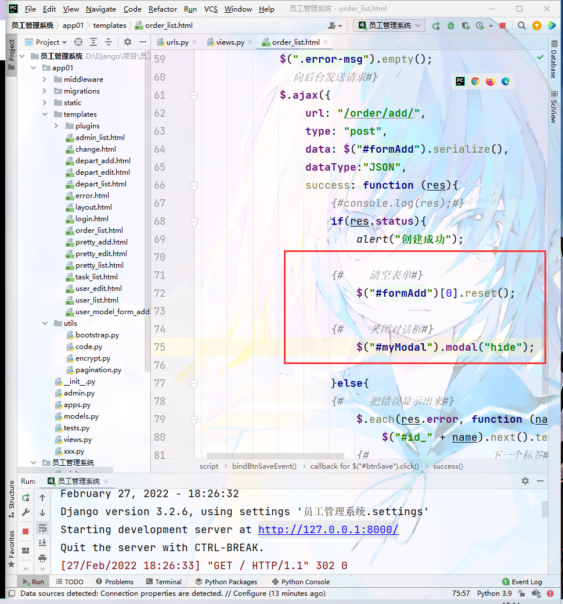
* # 刷新页面

  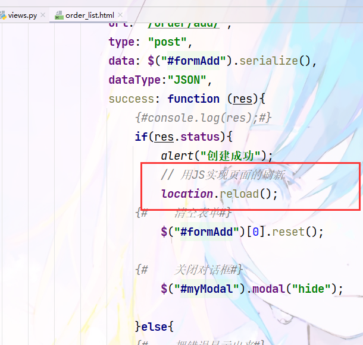
* # 删除按钮（对话框）

  * ## 通过样式来绑定事件

    ```django
                            <input class="btn btn-danger btn-xs btn-delete" type="button" value="删除">
    ```

  * ## 事件：

    ```js
    function bindBtnDeleteEvent() {
                $(".btn-delete").click(function () {
                    alert("点击了删除");
                });
            }
    ```
  * 像上面那样就可以绑定两个在一起
  * ## 然后加入对话框

    * ### 代码

      ```django
      {#        删除对话框#}
              <div class="modal fade" id="deleteModal" tabindex="-1" role="dialog" aria-labelledby="myModalLabel">
                  <div class="modal-dialog" role="document">
                      <div class="modal-content">
                          <div class="modal-header">
                              <button type="button" class="close" data-dismiss="modal" aria-label="Close"><span
                                      aria-hidden="true">&times;</span></button>
                              <h4 class="modal-title" id="myModalLabel">Modal title</h4>
                          </div>
                          <div class="modal-body">
                              ...
                          </div>
                          <div class="modal-footer">
                              <button type="button" class="btn btn-default" data-dismiss="modal">Close</button>
                              <button type="button" class="btn btn-primary">Save changes</button>
                          </div>
                      </div>
                  </div>
              </div>
          </div>
      ```
    * 给对话框写id`deleteModel`
    * 然后在下面的js中通过id写上绑定事件

      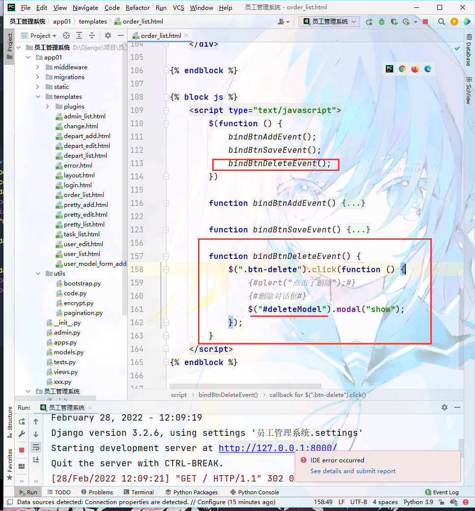
    * ### 显示对话框

      ```django
      $("#deleteModel").modal("show");
      ```
    * ### 警告对话框

      ```django
      <div class="modal fade" id="deleteModel" tabindex="-1" role="dialog" aria-labelledby="myModalLabel">
                  <div class="modal-dialog" role="document">
                      <div class="alert alert-danger alert-dismissible fade in" role="alert">
                          <button type="button" class="close" data-dismiss="alert" aria-label="Close"><span
                                  aria-hidden="true">×</span></button>
                          <h4>Oh snap! You got an error!</h4>
                          <p>Change this and that and try again. Duis mollis, est non commodo luctus, nisi erat porttitor
                              ligula, eget lacinia odio sem nec elit. Cras mattis consectetur purus sit amet fermentum.</p>
                          <p>
                              <button type="button" class="btn btn-danger">Take this action</button>
                              <button type="button" class="btn btn-default">Or do this</button>
                          </p>
                      </div>
                  </div>
              </div>
      ```

      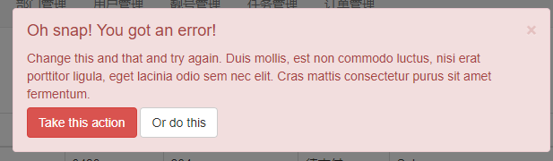

      * ### 优化一下：

        ```django
        <div class="modal fade" id="deleteModel" tabindex="-1" role="dialog" aria-labelledby="myModalLabel">
                    <div class="modal-dialog" role="document">
                        <div class="alert alert-danger alert-dismissible fade in" role="alert">
                            <h4>是否确定要删除</h4>
                            <p style="margin: 10px 0;">删除后，所有关联的数据都会被删除</p>
                            <p style="text-align: right;"> {# 把按钮放在右边 #}
                                <button type="button" class="btn btn-danger">Take this action</button>
                                <button type="button" class="btn btn-default">Or do this</button>
                            </p>
                        </div>
                    </div>
                </div>
        ```
  * ## 功能思路

    * ### 设置全局变量

      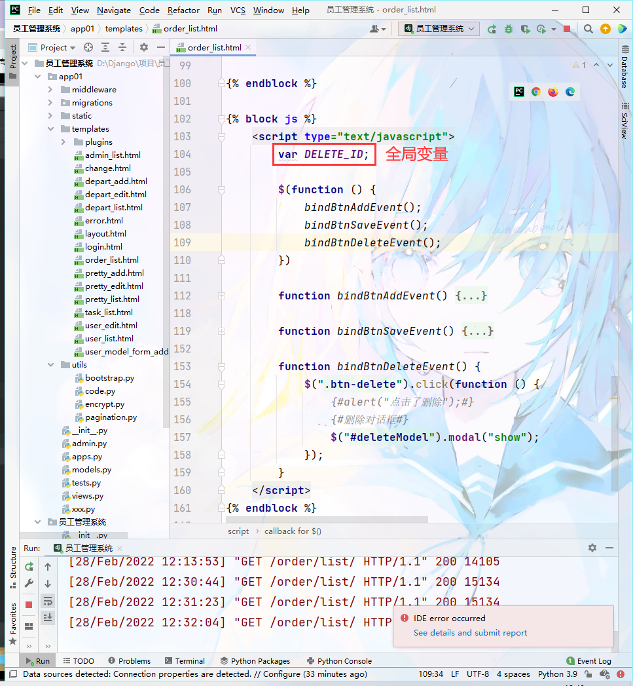
    * 哪个按钮一点，全局变量就等于那个id
    * ### 自定义一个uid属性

      ```django
                              <input uid="{{ i.id }}" class="btn btn-danger btn-xs btn-delete" type="button" value="删除">
      ```
    * 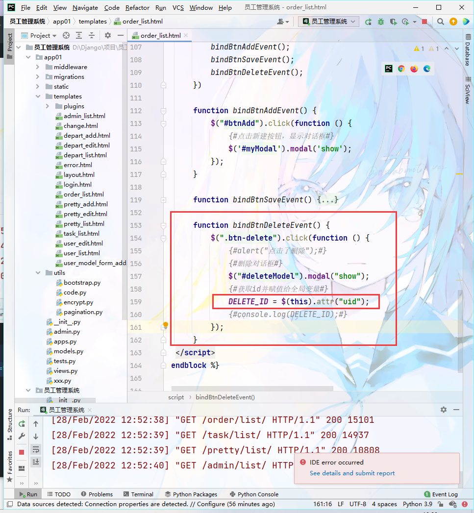

      `$(this)`是当前点击的这个标签，`attr`是获取这个值
    * ### 然后给确定删除按钮绑定事件

      ```django
      <button id ="btnComfirmDelete" type="button" class="btn btn-danger">确 定</button>
      ```

      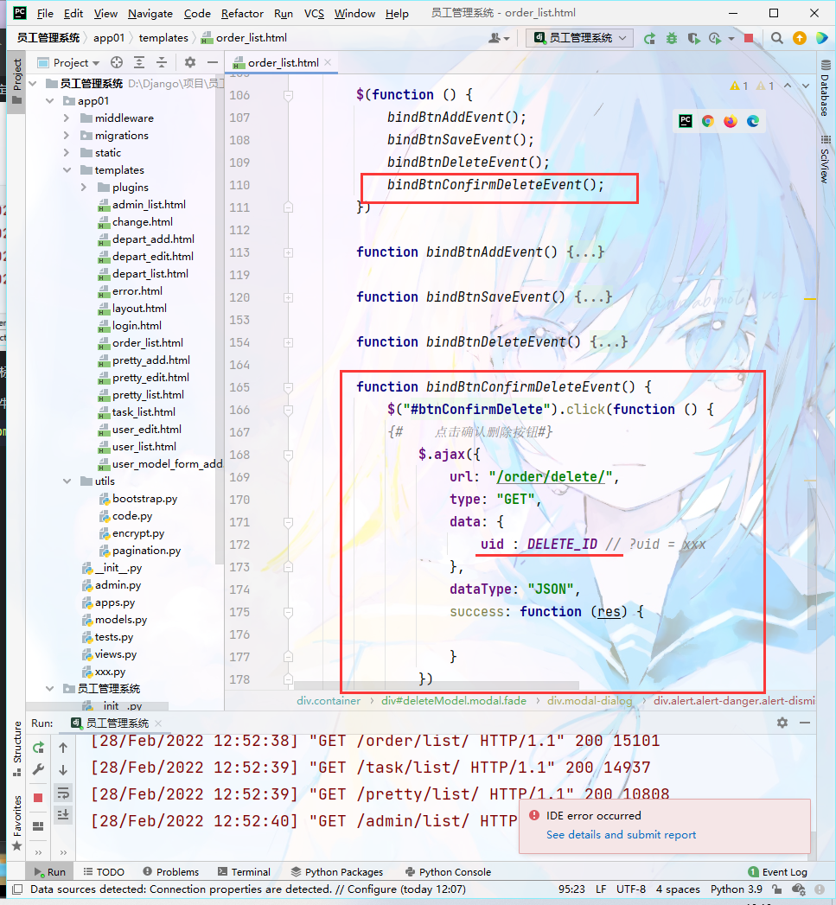

      把uid通过url的方式传到后端去
    * ### 函数

      ```python
      def order_delete(request):
          uid = request.GET.get("uid")
          exists = models.Order.objects.filter(id = uid).exists()
          if not exists:
              return JsonResponse({"status": False, "error": "删除失败 数据不存在"})
          models.Order.objects.filter(id = uid).delete()
          return JsonResponse({"status": True})
      ```
    * ### 前端函数

      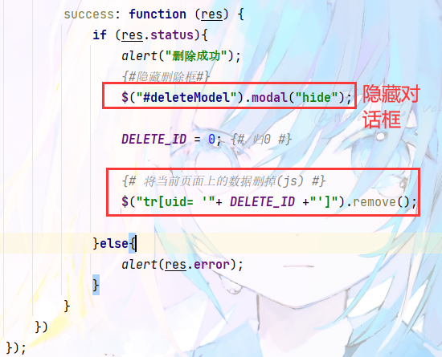

      但是这样的删除方法分页页码不会变（给表单中tr那一行加上id，然后找到在前端）

      所以还是选用刷新的方式

      ```js
      location.reload(); {# 刷新 #}
      ```
* # 编辑

  * 和添加共用一个对话框
  * 但是需要修改标题
  * 那就在前端函数中来修改

    * 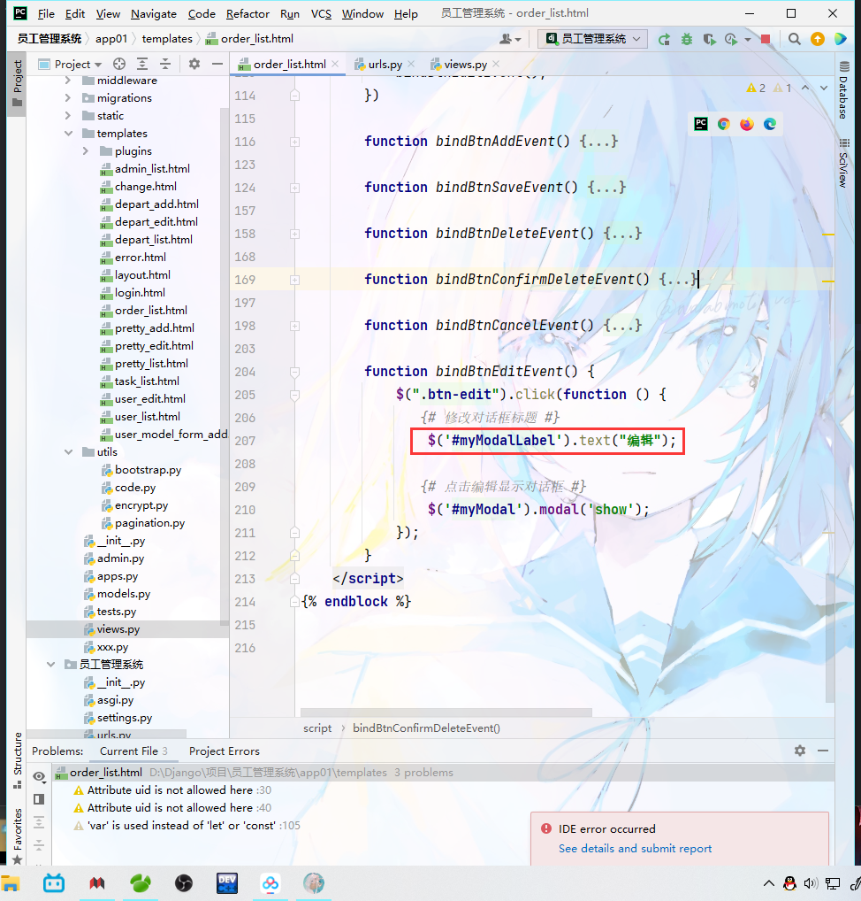
    * 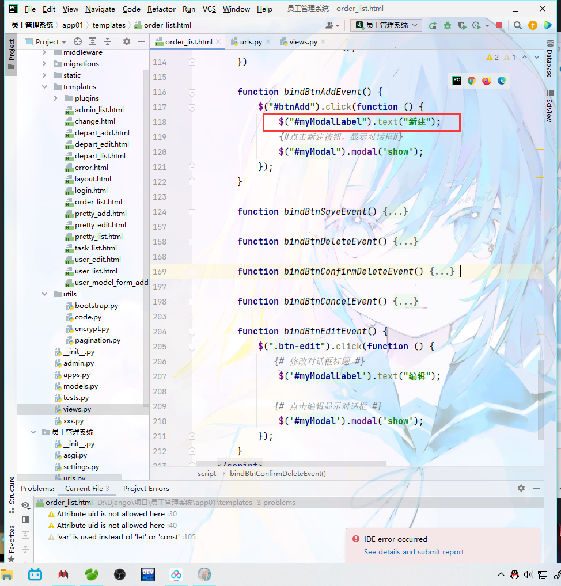
  * 然后因为要编辑，所以需要在对话框中有原始数据
  * 然后应该是成功拿到数据后才显示对话框，所以把显示对话框放到里面来

    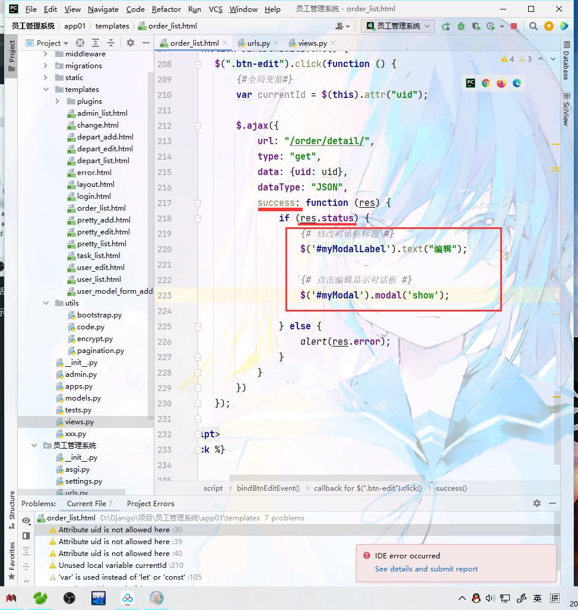
  * 就像后端发送ajax请求，和删除同理，给按钮加上自定义的uid属性，然后把这个值通过get的方式传到后端

    ```js
    $.ajax({
                        url: "/order/detail/",
                        type: "get",
                        data: {uid: uid},
                        dataType: "JSON",
                        success: function (res) {
                            if (res.status) {
                                {# 修改对话框标题 #}
                                $('#myModalLabel').text("编辑");

                                {# 点击编辑显示对话框 #}
                                $('#myModal').modal('show');

                            } else {
                                alert(res.error);
                            }
                        }
                    })
    ```
  * 函数

    * 在数据库里获取数据
    * 方法1

      ```js
      uid = request.GET.get("uid")
          row_object = models.Order.objects.filter(id=uid).filter()
          if not row_object:
              return JsonResponse({"status": False, "error": "删除失败 数据不存在"})
          result = {
              "status": True,
              "data": {
                  "title": row_object.title,
                  "price": row_object.price,
                  "status": row_object.status,
              }
          }
          return JsonResponse(result)
      ```

      需要手动写很多字段
    * 方法2

      直接获取数据库，指定某些字段的值

      ```js
      uid = request.GET.get("uid")
      row_dict = models.Order.objects.filter(id=uid).values("title", 'price', 'status').first()
      if not row_dict:
          return JsonResponse({"status": False, 'error': "数据不存在。"})

      # 从数据库中获取到一个对象 row_object
      result = {
          "status": True,
          "data": row_dict
      }
      return JsonResponse(result)
      ```

      通过`values` 里面加字段来获取

      这样直接返回的就是一个字典

      更方便
    * 详细

      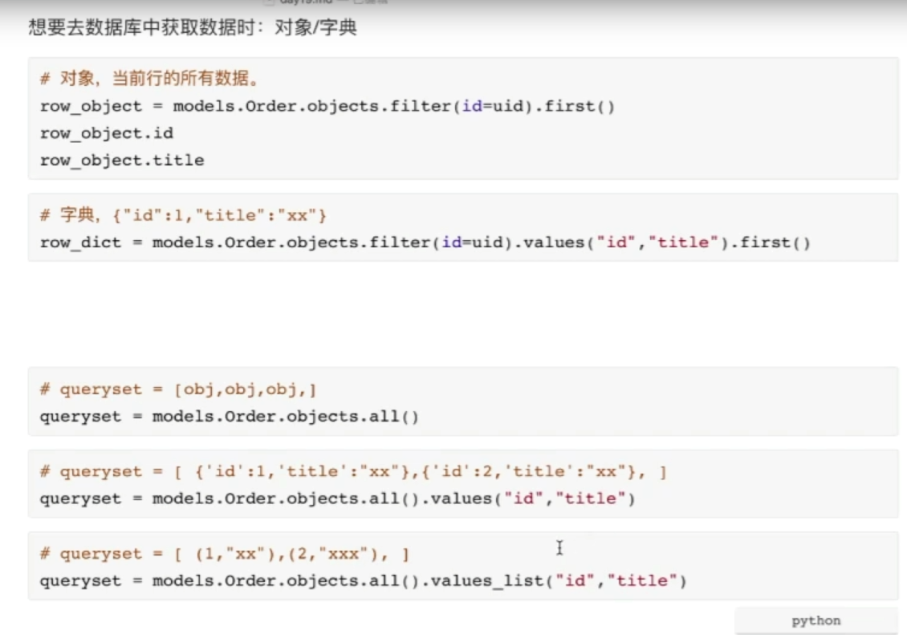
    * 然后给每个框里面赋值
    * 因为每个框都有一个默认id，就是`id+字段名`，然就循环获取的字典，两个变量每一个是字段名，一个是值，然后把值写进字段里

      ```js
      {#将数据赋值进对话框               字段名  值#}
      $.each(res.data, function (name, value){
          $("#id_" + name).val(value)
      })
      ```
    * 然后因为是共用的同一个，所以在添加时，需要把原本框里面的值清空

      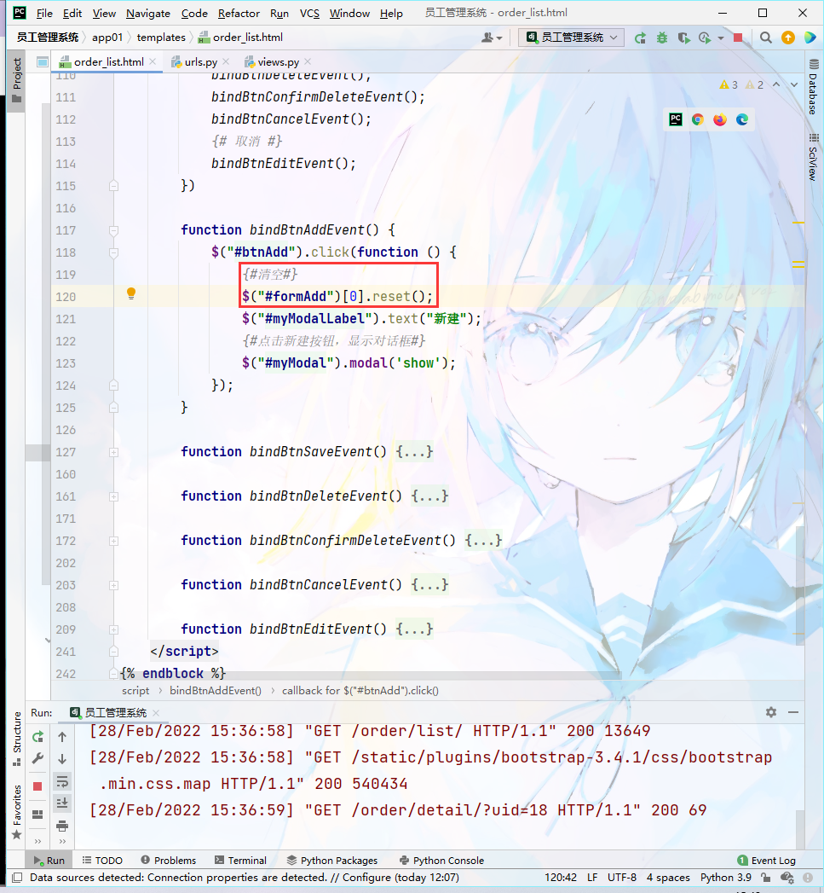
    * 然后因为共用的一个对话框

      所以对于那个保存按钮，

      要分情况发送请求

      定义一个全局变量，如果有值就是edit，没有就是add

      * 代码

        * 视图

          ```js
          {#这是那个保存按钮哪里发送请求#}

                  function bindBtnSaveEvent() {
                      $("#btnSave").click(function () {
                          {#清除所有错误信息#}
                          $(".error-msg").empty();

                          if (EDIT_ID) {
                              {#    编辑#}
                              doEdit();
                          } else {
                              {#    添加#}
                              doAdd();
                          }
                      });
                  }

                  function doAdd() {
                      {#                向后台发送请求#}
                      $.ajax({
                          url: "/order/add/",
                          type: "post",
                          data: $("#formAdd").serialize(),
                          dataType: "JSON",
                          success: function (res) {
                              {#console.log(res);#}
                              if (res.status) {
                                  {#alert("创建成功");#}
                                  // 用JS实现页面的刷新
                                  location.reload();
                                  {#    清空表单#}
                                  $("#formAdd")[0].reset();

                                  {#    关闭对话框#}
                                  $("#myModal").modal("hide");

                              } else {
                                  if (res.tips) {
                                      alert(res.tips);
                                  }
                                  {#    把错误显示出来#}
                                  $.each(res.error, function (name, errorList) {
                                      $("#id_" + name).next().text(errorList[0])
                                      {#                   下一个标签#}
                                  })
                              }
                          }
                      })
                  }

                  function doEdit() {
                      {#                向后台发送请求#}
                      $.ajax({
                          url: "/order/edit/" + "?nid=" + EDIT_ID,
                          type: "post",
                          data: $("#formAdd").serialize(),
                          dataType: "JSON",
                          success: function (res) {
                              {#console.log(res);#}
                              if (res.status) {
                                  alert("创建成功");
                                  // 用JS实现页面的刷新
                                  location.reload();
                                  {#    清空表单#}
                                  $("#formAdd")[0].reset();

                                  {#    关闭对话框#}
                                  $("#myModal").modal("hide");

                              } else {
                                  {#    把错误显示出来#}
                                  if (res.tips) alert(res.tips)
                                  else {
                                      $.each(res.error, function (name, errorList) {
                                          $("#id_" + name).next().text(errorList[0])
                                          {#                   下一个标签#}
                                      })
                                  }

                              }
                          }
                      })
                  }
          ```
        * 函数

          * Edit

            ```js
            @csrf_exempt
            def order_edit(request):
                # 编辑页面
                nid = request.GET.get("nid")
                row_object = models.Order.objects.filter(id = nid).first()
                if not row_object:
                    # print(1)
                    return JsonResponse({"status": False, "tips": "数据不存在, 请刷新重试"})

                form = OrderModelForm(data = request.POST, instance= row_object)
                if form.is_valid():
                    form.save()
                    return JsonResponse({"status": True})
                return JsonResponse({"status": False, "errors": form.errors})
            ```
          * Add

            ```js
            def order_add(request):
                # 新建订单
                form = OrderModelForm(data=request.POST)
                if form.is_valid():
                    form.instance.admin_id = request.session["info"]["id"]
                    form.instance.oid = datetime.now().strftime("%Y%m%d%H%M%S") + str(random.randint(1000, 9999))
                    form.save()
                    return JsonResponse({"status": True})
                return JsonResponse({"status": False, "error": form.errors})
            ```
*

　　
