* # 画图

  * echarts 国内
* 我觉得引入太麻烦了就直接下载了CDN

  * 刚开始下不了，然后随便点点就下得了了

    ```js
    <script src="https://cdn.jsdelivr.net/npm/echarts@5.3.0/dist/echarts.min.js"></script>
    ```
* 用法

  这个就是让图标和页面中的标签相匹配

  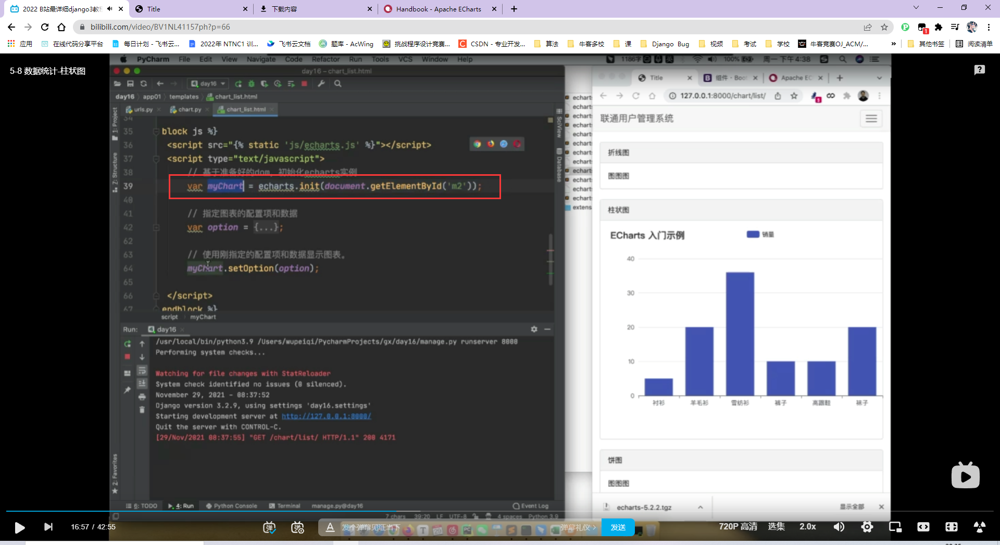

  

  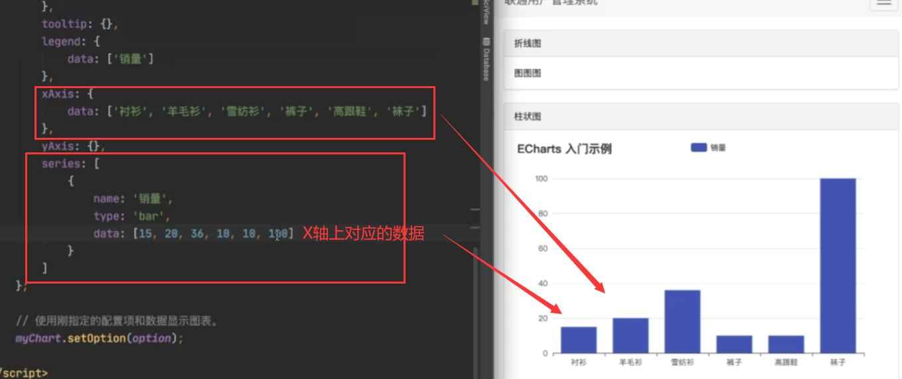

  * 还可以再加一列

    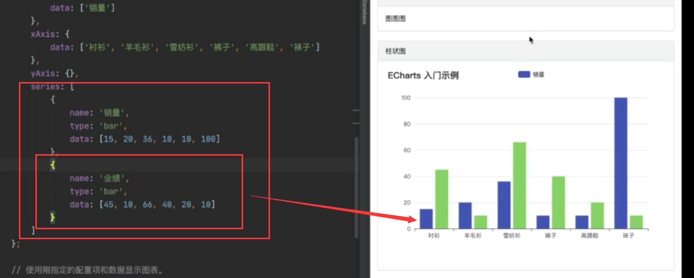
  * 加上图例

    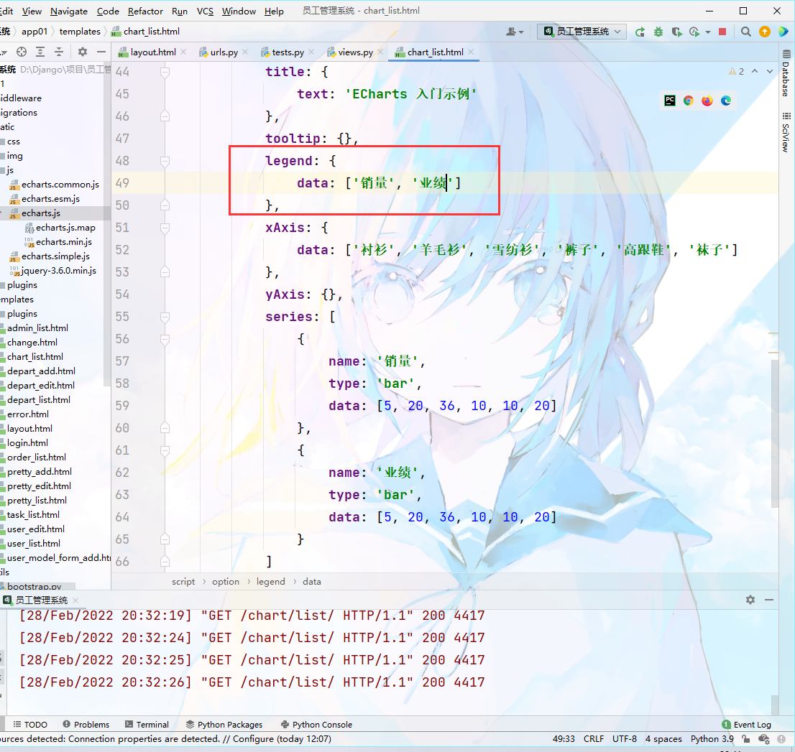
  * 图例位置

    加上这个就是在下面

    不加默认在上面

    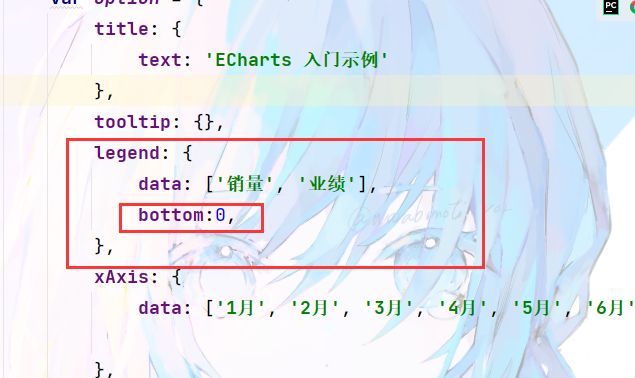
  * 标题的对齐方式

    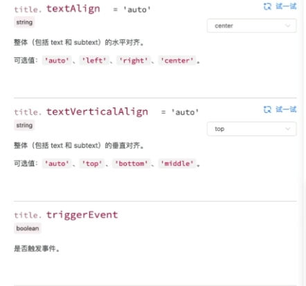

    * 居中对齐

      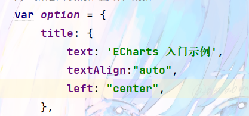
    *
  * 副标题

    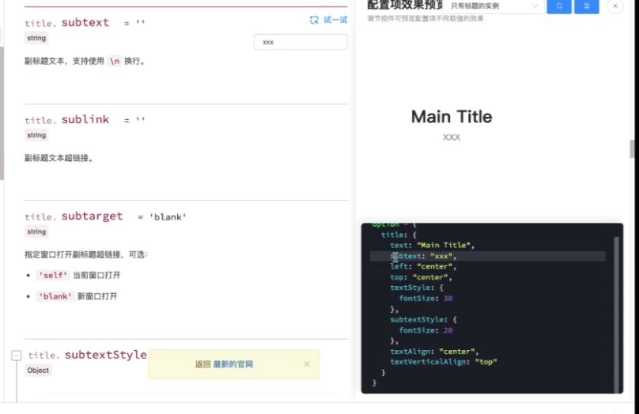
* 总体来说用法就是在下面写js函数，然后就是去套模板，然后可以向前端发送请求数据，后面对应的位置显示对应的东西即可
* 然后给对应得div框里面加上id，对应好下面得图表即可
* 后端传数据

  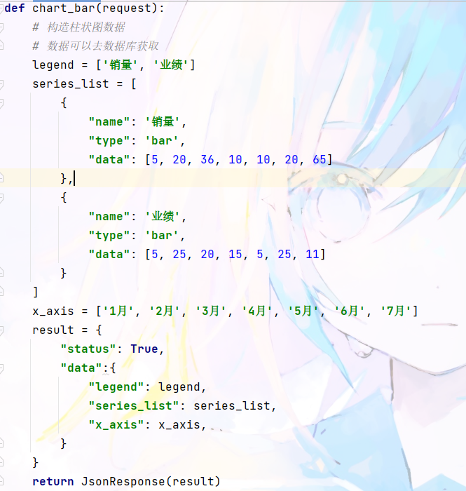
* 前端发送请求和接收，然后写到对应的表格里即可

  * 前端函数

    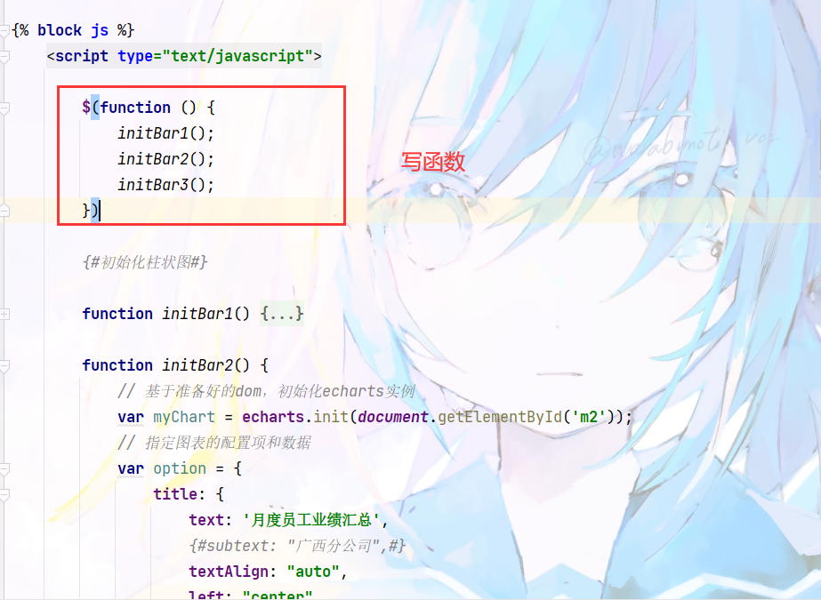
  * 对应好样式id

    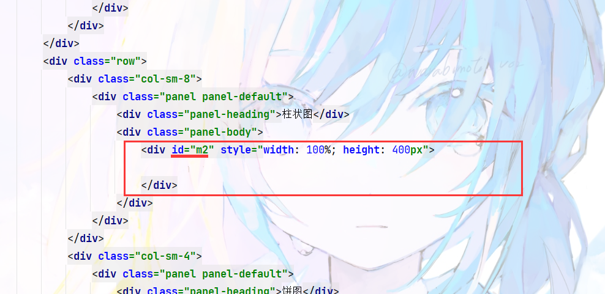

    
  * 发送请求并接收数据

    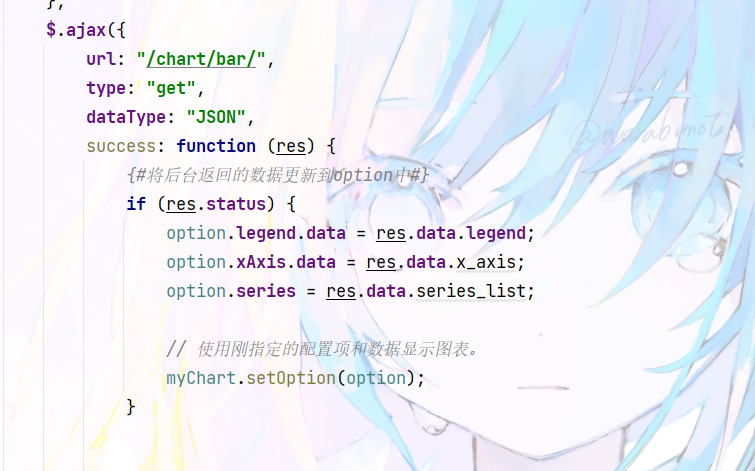
  *

　　
