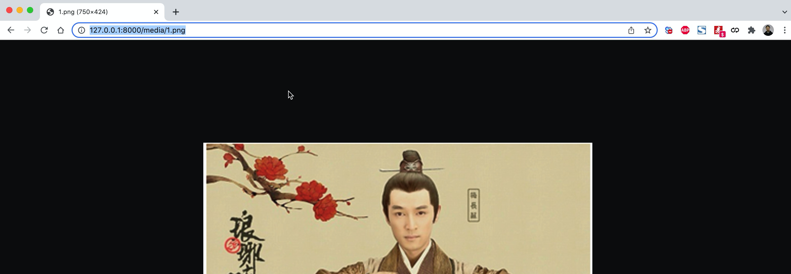
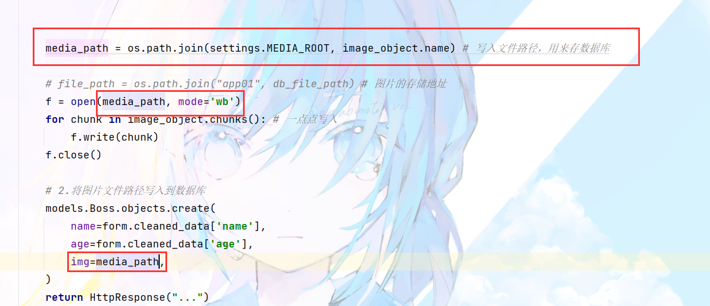
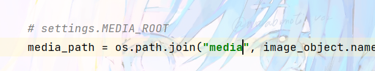
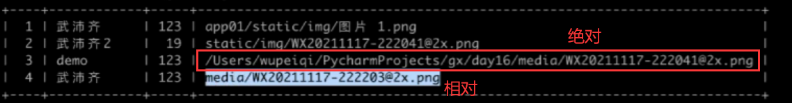

## 2.关于文件上传

### 2.1 基本操作

```html
<form method="post" enctype="multipart/form-data"> {# 表单后面必须要加上这个，因为这样传的才是文件 #}
    
    <input type="text" name="username">
    <input type="file" name="avatar"> {# 这个是文件的输入框，点击上传文件 #}
    <input type="submit" value="提交">
</form>
```

```python
from django.shortcuts import render, HttpResponse


def upload_list(request):
    if request.method == "GET":
        return render(request, 'upload_list.html')

    # # 'username': ['big666']
    # print(request.POST)  # 请求体中数据
    # # {'avatar': [<InMemoryUploadedFile: 图片 1.png (image/png)>]}>
    # print(request.FILES)  # 请求发过来的文件 {}

    file_object = request.FILES.get("avatar") # 这样获取到传过来的文件
    # print(file_object.name)  # 文件名：WX20211117-222041@2x.png

    f = open(file_object.name, mode='wb')# 然后打开一个文件
    for chunk in file_object.chunks(): # 循环遍历获取的那个文件
        f.write(chunk) # 将文件一点一点的写入
    f.close() # 关闭文件
    return HttpResponse("...")
```

### 案例：批量上传数据

* 读取excel

  安装插件

  `pip install openpyxl`

```html
<form method="post" enctype="multipart/form-data" action="/depart/multi/">
    
    <div class="form-group">
        <input type="file" name="exc">
    </div>
    <input type="submit" value="上传" class="btn btn-info btn-sm">
</form>
```

```python
def depart_multi(request):
    """ 批量删除（Excel文件）"""
    from openpyxl import load_workbook

    # 1.获取用户上传的文件对象
    file_object = request.FILES.get("exc")

    # 2.对象传递给openpyxl，由openpyxl读取文件的内容
    wb = load_workbook(file_object)
    sheet = wb.worksheets[0] # 这是获取第一张表

    # 3.循环获取每一行数据
    for row in sheet.iter_rows(min_row=2):# 行数限制，从第二行开始
        text = row[0].value # 第一列的值
        exists = models.Department.objects.filter(title=text).exists() # 判断是否存在
        if not exists:
            models.Department.objects.create(title=text) # 保存第一列的值

    return redirect('/depart/list/')
```

### 案例：混合数据（Form）

　　提交页面时：用户输入数据 + 文件（输入不能为空、报错）。

* Form生成HTML标签：type=file
* 表单的验证
* form.cleaned_data 获取 数据 + 文件对象

```html





    <div class="container">
        <div class="panel panel-default">
            <div class="panel-heading">
                <h3 class="panel-title"> {{ title }} </h3>
            </div>
            <div class="panel-body">
                <form method="post" enctype="multipart/form-data" novalidate >
                    

                    
                        <div class="form-group">
                            <label>{{ field.label }}</label>
                            {{ field }}
                            <span style="color: red;">{{ field.errors.0 }}</span>
                        </div>
                    

                    <button type="submit" class="btn btn-primary">提 交</button>
                </form>
            </div>
        </div>
    </div>



```

```python
from django import forms
from app01.utils.bootstrap import BootStrapForm


class UpForm(BootStrapForm):
    bootstrap_exclude_fields = ['img']

    name = forms.CharField(label="姓名")
    age = forms.IntegerField(label="年龄")
    img = forms.FileField(label="头像")


def upload_form(request):
    title = "Form上传"
    if request.method == "GET":
        form = UpForm()
        return render(request, 'upload_form.html', {"form": form, "title": title})

    form = UpForm(data=request.POST, files=request.FILES)
    if form.is_valid():
        # {'name': '武沛齐', 'age': 123, 'img': <InMemoryUploadedFile: 图片 1.png (image/png)>}
        # 1.读取图片内容，写入到文件夹中并获取文件的路径。
        image_object = form.cleaned_data.get("img")

        # file_path = "app01/static/img/{}".format(image_object.name)
        db_file_path = os.path.join("static", "img", image_object.name) # 写入文件路径

        file_path = os.path.join("app01", db_file_path)
        f = open(file_path, mode='wb')
        for chunk in image_object.chunks(): # 一点点写入
            f.write(chunk)
        f.close()

        # 2.将图片文件路径写入到数据库
        models.Boss.objects.create(
            name=form.cleaned_data['name'],
            age=form.cleaned_data['age'],
            img=db_file_path,
        )
        return HttpResponse("...")
    return render(request, 'upload_form.html', {"form": form, "title": title})

```

　　注意：就目前而言，所有的静态文件都只能放在static目录。

　　在django的开发过程中两个特殊的文件夹：

* static，存放静态文件的路径，包括：CSS、JS、项目图片(背景图片之类的)。
* media，用户上传的数据的目录。

### 2.2 启用media

　　在urls.py中进行配置：

```python
from django.urls import path, re_path
from django.views.static import serve
from django.conf import settings

urlpatterns = [
	re_path(r'^media/(?P<path>.*)$', serve, {'document_root': settings.MEDIA_ROOT}, name='media'), # 固定写法
]
```

　　在settings.py中进行配置：

```python
import os

#                        项目根目录 
MEDIA_ROOT = os.path.join(BASE_DIR, "media") # 指media在项目根目录里
MEDIA_URL = "/media/"
```

　　在浏览器上访问这个地址，即可查看图片：

　　

### 案例：混合数据（form）

　　直接存进media目录里面

　　

　　写成相对路径，方便一点

　　

　　

　　

```python
from django import forms
from app01.utils.bootstrap import BootStrapForm


class UpForm(BootStrapForm):
    bootstrap_exclude_fields = ['img']

    name = forms.CharField(label="姓名")
    age = forms.IntegerField(label="年龄")
    img = forms.FileField(label="头像")


def upload_form(request):
    title = "Form上传"
    if request.method == "GET":
        form = UpForm()
        return render(request, 'upload_form.html', {"form": form, "title": title})

    form = UpForm(data=request.POST, files=request.FILES)
    if form.is_valid():
        # {'name': '武沛齐', 'age': 123, 'img': <InMemoryUploadedFile: 图片 1.png (image/png)>}
        # 1.读取图片内容，写入到文件夹中并获取文件的路径。
        image_object = form.cleaned_data.get("img")

        # media_path = os.path.join(settings.MEDIA_ROOT, image_object.name)
        media_path = os.path.join("media", image_object.name)
        f = open(media_path, mode='wb')
        for chunk in image_object.chunks():
            f.write(chunk)
        f.close()

        # 2.将图片文件路径写入到数据库
        models.Boss.objects.create(
            name=form.cleaned_data['name'],
            age=form.cleaned_data['age'],
            img=media_path,
        )
        return HttpResponse("...")
    return render(request, 'upload_form.html', {"form": form, "title": title})
```

### 案例：混合数据（ModelForm)

#### models.py

```python
class City(models.Model):
    """ 城市 """
    name = models.CharField(verbose_name="名称", max_length=32)
    count = models.IntegerField(verbose_name="人口")

    # 本质上数据库也是CharField，自动保存数据。                  可以实现自动上传至哪个目录
    img = models.FileField(verbose_name="Logo", max_length=128, upload_to='city/')
```

#### 定义ModelForm

```python
from app01.utils.bootstrap import BootStrapModelForm


class UpModelForm(BootStrapModelForm):
    bootstrap_exclude_fields = ['img'] # 除去这个不上样式

    class Meta:
        model = models.City
        fields = "__all__"
```

#### 视图

```python
def upload_modal_form(request):
    """ 上传文件和数据（modelForm）"""
    title = "ModelForm上传文件"
    if request.method == "GET":
        form = UpModelForm()
        return render(request, 'upload_form.html', {"form": form, 'title': title})

    form = UpModelForm(data=request.POST, files=request.FILES)
    if form.is_valid():
        # 对于文件：自动保存；
        # 字段 + 上传路径写入到数据库
        form.save()
      
        return HttpResponse("成功")
    return render(request, 'upload_form.html', {"form": form, 'title': title})
```

### 小结

* 自己手动去写

  ```python
  file_object = request.FILES.get("exc")
  ...
  ```
* Form组件（表单验证）

  ```python
  request.POST
  file_object = request.FILES.get("exc")

  具体文件操作还是手动自己做。
  ```
* ModelForm（表单验证 + 自动保存数据库 + 自动保存文件）

  ```
  - Media文件夹
  - Models.py定义类文件要
  	img = models.FileField(verbose_name="Logo", max_length=128, upload_to='city/')
  ```

## 总结

　　关于django的开发知识点，更多的案例：

* Python基础（课件 https://gitee.com/wupeiqi/python_course）

  ```
  https://www.bilibili.com/video/BV1m54y1r7zE
  ```
* 并发编程（进程线程协程）

  ```
  https://www.bilibili.com/video/BV1Ev411G7i3?spm_id_from=333.999.0.0

  # 不建议小白学（协程）
  https://www.bilibili.com/video/BV1NA411g7yf?spm_id_from=333.999.0.0
  ```
* MySQL数据库

  ```python
  # 2021最新推荐
  https://www.bilibili.com/video/BV15R4y1b7y9?spm_id_from=333.999.0.0

  # 2017年
  https://www.bilibili.com/video/BV1DE411n7fU?
  ```
* 前端开发

  ```python
  https://www.bilibili.com/video/BV1QE411j7bV?spm_id_from=333.999.0.0
  ```
* django开发知识点

  ```
  https://www.bilibili.com/video/BV1zE411x7LG
  https://www.bilibili.com/video/BV1JE411V7xk
  ```
* 项目开发

  ```
  任务管理平台：https://www.bilibili.com/video/BV1uA411b77M
  ```
* 进阶项目（增删改查、权限）

  ```python
  https://space.bilibili.com/283478842/channel/detail?cid=91596&ctype=0
  ```
* 前后端分离的项目： django + drf框架 + vue.js

  ```
  - Django
  - drf框架
  	- https://www.bilibili.com/video/BV1ZE411j7RK
  ```
* git 版本控制和协同开发 + 任务管理平台

  ```
  https://www.bilibili.com/video/BV19E411f76x?spm_id_from=333.999.0.0
  ```
* 微信小程序 + Django + drf框架编写

  ```python
  https://www.bilibili.com/video/BV1jC4y1s7QD?spm_id_from=333.999.0.0
  ```
